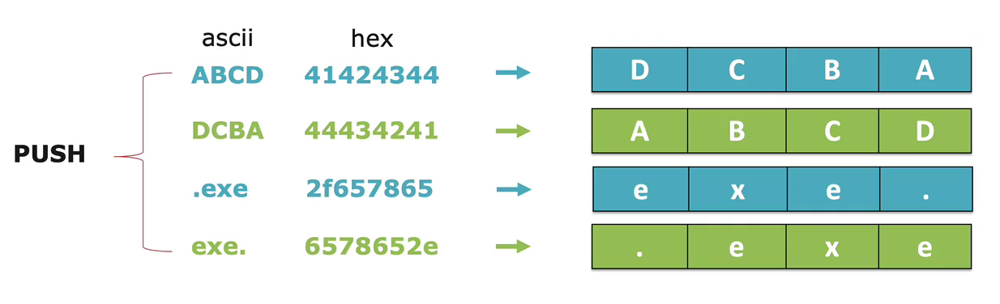

# Assembly

Existem duas sintaxes diferentes para programar em assembly (Intel ou AT&T)

Algumas diferencas entre elas:


```
Intel:                              | AT&T:
						            |
	        destino    <-   origem  |                 origem    ->   destino 
MOV           EAX,            3     |   MOVL           $0x3,           %eax
                                    |
                                    | 
xor      eax,eax                    |   xor      %eax,%eax  
mov      eax,0x2328                 |   mov      %0x2328,%eax
push     eax                        |   push     %eax
mov      ebx,0x76129010             |   mov      %0x76129010,%ebx
call     ebx                        |   call     %ebx
```

Na AT&T usamos % para registradores e $ para numeros e podemos definid


## Exemplos de instrucoes

* MOV 
* ADD 
* SUB 
* INC 
* DEC 
* CALL 
* JMP
* JNE
* CMP
* PUSH
* POP
* NOP3
* INT3
* XOR


`_main` pode ser qualquer coisa,

```assembly
global _main

section .text
_main:
	NOP
	NOP
	NOP
	NOP
	MOV EAX, 41424344h ; ABCD in Hexadecimal
	MOV BX, 4141h
	MOV CH, 41h
	MOV DL, 41h
	XOR EAX, EAX
	XOR EBX, EBX
	XOR ECX, ECX
	XOR EDX, EDX
```

```
nasm -f win32 test.asm
golink /entry _main test.obj
```


<figure><figcaption></figcaption></figure>


## Assembly Linux x86


```asm
global _main

section .data
        test: db 'My test text', 0xa

section .text

_main:
        mov eax, 4
        mov ebx, 1
        mov ecx, test
        mov edx, 13
        int 0x80

        mov eax, 1
        mov ebx, 0
        int 0x80
```

```
$ nasm -f elf32 test.asm                      
$ ld --entry _main -m elf_i386 test.o -o test
$ ./test                                      
My test text
```

