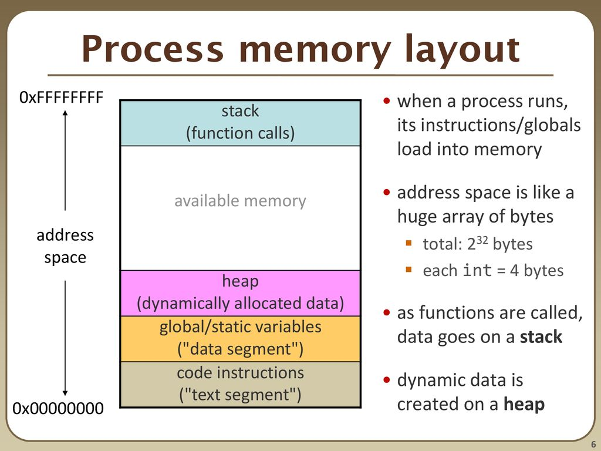

# Computer Architecture

O CPU é o "cérebro" de um computador, é responsável por realizar diversas operações lógicas, aritméticas, processamento de dados, etc.

O processador é responsável por executar o código de máquina de um programa de computador.

Machine Code é um conjunto de instruções que a CPU processa.

Essas instruções são representadas em formato hexadecimal.

```
31 c0
b8 28 23 00 00
50
bb 10 90 12 76
ff d3
```

Como é quase impossível ler esses códigos, foi criado o Assembly.

```
31 c0                       xor          eax,eax  
b8 28 23 00 00              mov          eax,0x2328
50                          push         eax
bb 10 90 12 76              mov          ebx,0x76129010
ff d3                       call         ebx
```


Cada CPU tem um conjunto de registradores que são pequenos locais para ler e manipular dados de uma forma extremamente rápida.


x86 - Processadores de 32 bits
x64 - Processadores de 64 bits (x86_64 / AMD64)


## Registradores

| 64 bits | 32 bits                       | 16 bits | 8 bits       |
| ------- | ----------------------------- | ------- | ------------ |
| **RAX** | **EAX - Accumulator**         | **AX**  | **AH \| AL** |
| **RBX** | **EBX - Base**                | **BX**  | **BH \| BL** |
| **RCX** | **ECX - Counnter**            | **CX**  | **CH \| CL** |
| **RDX** | **EDX - Data**                | **DX**  | **DH \| DL** |
| **RSI** | **ESI - Source Index**        | **SI**  |              |
| **RDI** | **EDI - Destination Index**   | **DI**  |              |
| **RSP** | **ESP - Stack Pointer**       | **SP**  |              |
| **RBP** | **EBP - Bse Pointer**         | **BP**  |              |
| **RIP** | **EIP - Instruction Pointer** | **IP**  |              |

## Processo em memória


<figure><figcaption></figcaption></figure>