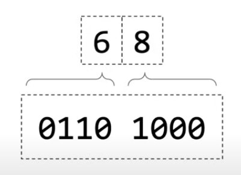
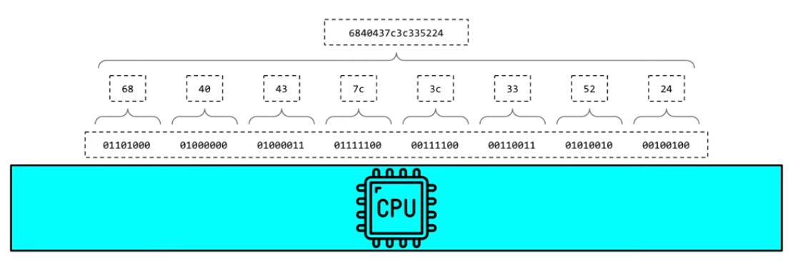
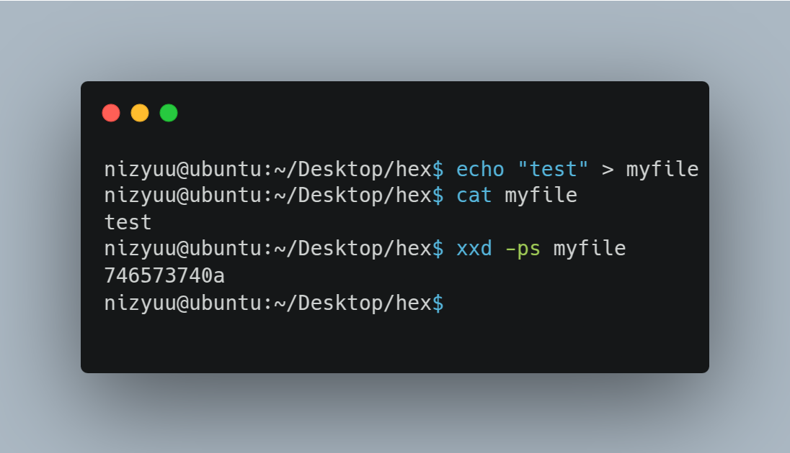
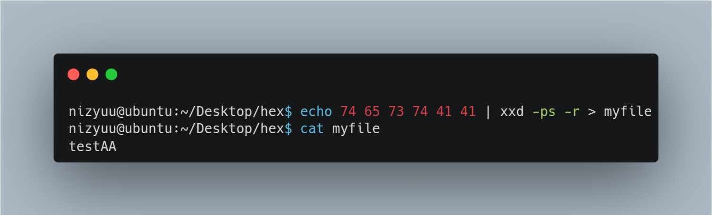

# Hexadecimal

We've talked about bits previously and our computer doesn't think about bits individually. It thinks about bits in groups, typically groups of eight which is called a byte. Hexadecimals has some advantages, starting with thee number of symbols: 16. They are 0, 1, 2, 3, 4, 5, 6, 7, 8, 9, A, B, C, D, E and F. The numbers they form are normally prefixed with `0x`.

| Hexadecimal | Decimal | Octal | Binário |
| ----------- | ------- | ----- | ------- |
| **0**       | **0**   | **0** | **0**   |
| **1**       | **1**   | **1** | **1**   |
| **2**       | **2**   | **2** | 10      |
| **3**       | **3**   | **3** | 11      |
| **4**       | **4**   | **4** | 100     |
| **5**       | **5**   | **5** | 101     |
| **6**       | **6**   | **6** | 110     |
| **7**       | **7**   | **7** | 111     |
| **8**       | **8**   | 10    | 1000    |
| **9**       | **9**   | 11    | 1001    |
| **A**       | 10      | 12    | 1010    |
| **B**       | 11      | 13    | 1011    |
| **C**       | 12      | 14    | 1100    |
| **D**       | 13      | 15    | 1101    |
| **E**       | 14      | 16    | 1110    |
| **F**       | 15      | 17    | 1111    |

Hexadecimal is a really useful representation for binary data. In the next example, we can look those first four digits (first four bits) `0110` is the same range as one hex digit number 6. On the right `1000` can be represent by another hex digit number eight.

<figure><figcaption></figcaption></figure>

If you have a multiple bytes in you CPU and you want to represent multiple bytes in HEX, we can concatenate them.

<figure><figcaption></figcaption></figure>

We can also use hex to transmit binary data over channels where binary data is inconvenience to transfer.

<figure><figcaption></figcaption></figure>

<figure><figcaption></figcaption></figure>
