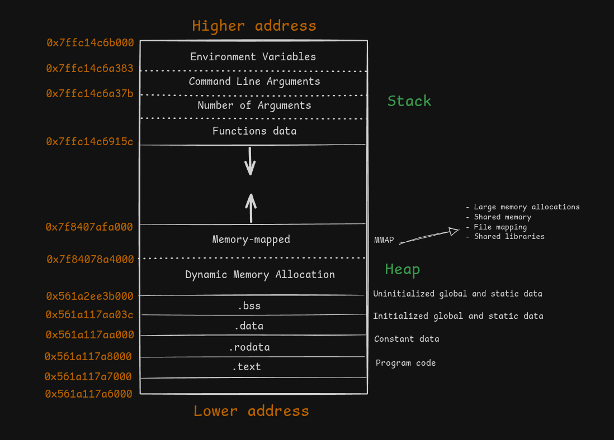
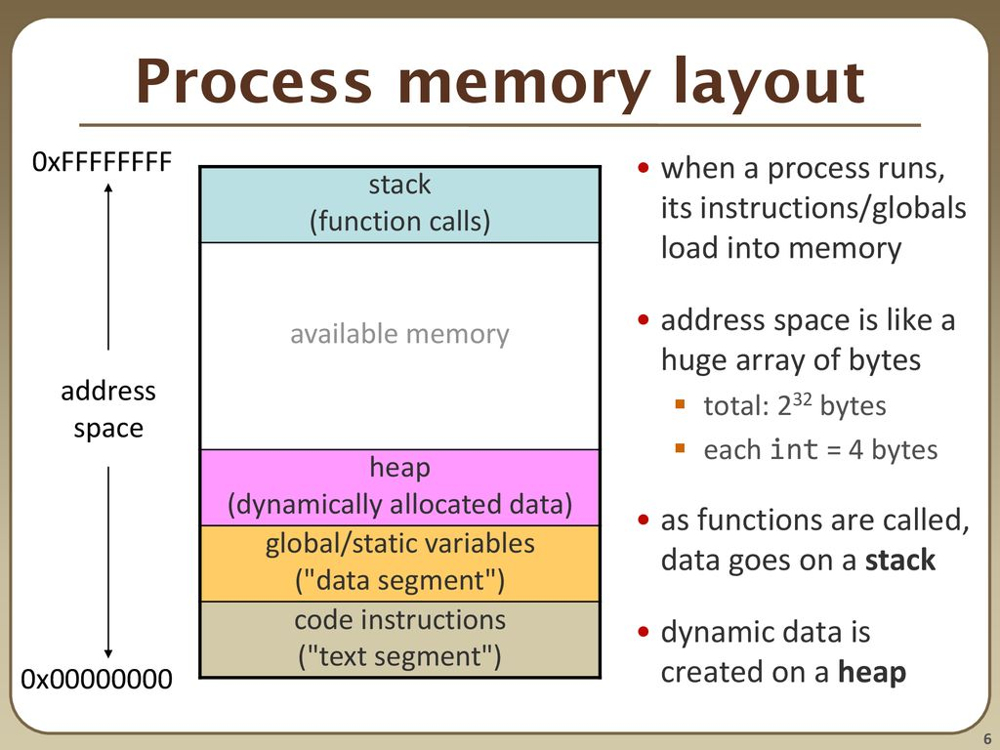

# Memory layout

## Como os processos são iniciados

Processos são estruturas de dados que o kernel utiliza para gerenciar a execução dos programas. De todas essas estruturas, duas são muito importantes, que são:

* Sistema de arquivo virtual, que o kernel gera a partir de todos os processos em execução no sistema no momento. Assim é disponibilizado então informações diversas na forma de arquivo de texto (ex: `ls /proc`);
* Espaço de endereços de memória que é disponibilizado para cada programa em execução. Esse espaço de endereço segue um padrão que chamamos de layout de memória.


O shell é o componente responsável por interpretar linhas de comandos e se houver a invocação do programa, providenciar a execução desse programa. Mas nada impede que outros programas diferentes do shell (por exemplo programas lançadores) implementem mecanismos no seu código equivalentes a aqueles mecanismos que o shell utiliza para executar programas ou mais exatamente, iniciar novos processos. 

Assim que o shell recebe a nossa linha de comando, interpretou e viu que tinha a necessidade de executar o programa, a primeira coisa que ele faz é a invocação de uma função interna do kernel que chamamos de chamada de sistema, especificamente a chamada de sistema `fork`. Existe a função fork na `glibc` que vai levar a execução da chamada de sistema fork (porém fork não é a única função desse grupos de funções, o bash que é o shell padrão do GNU não executa a chamada de sistema fork e sim uma chamada de sistema padrão equivalente que chamada clone). Fork e clone são chamadas de sistema responsáveis por duplicar o processo que está fazendo a chamada de sistema, no caso o processo shell, em um clone, uma duplicata. Após executar a chamada de sistema fork, o processo do shell vai continuar existindo e sendo executado ao mesmo tempo em que uma cópia do seu processo é gerada e vai executar o mesmo código. O resultado da chamada fork é a existência de dois processos exatamente iguais exceto por um detalhe que é pelo número de identificação chamado `pid`.

<figure><figcaption></figcaption></figure>

## Processo em memória

<figure><figcaption></figcaption></figure>


O processo original do shell, que chamamos de processo pai, irá executar uma outra chmada de sistema, chamada wait, e vai ficar aguardando o fim o término do processo filho que é a duplicata feito na chamada fork. Esse processo filho por sua vez, vai executar outra chamada de sistema que é a chamada `exec`. A `exec` também é uma chamada de sistema que possui algumas variações, normalmente o bash chamaria a função `execvp()` mas existem outras opções que veremos. É a chamada de sistema `exec` que vai substituir parte do conteúdo do processo clonado ,do processo do shell, por dados relativos ao programa que estiver sendo executado e seus argumentos.

```c
#include <stdio.h>
#include <stdlib.h>
#include <unistd.h>
#include <sys/types.h>
#include <sys/wait.h>

int main(void) {

    pid_t pid = fork();

    if (pid < 0) {
        perror("fork failed");
        exit(EXIT_FAILURE);
    }

/*
    Um segundo processo é criado e o código seguinte será executado
    por ambos os processo (eles são identicos), mas com valores
    de pid diferentes:

    - Para o processo filho, pid == 0
    - Para o processo pai, pid == PID do processo filho
*/

    if (pid == 0) {
        printf("[Filho] PID: %d, iniciado.\n", getpid());
        
        char *args[] = {"ls", "-l", NULL};
        execvp(args[0], args);
        
        perror("execvp failed");
        exit(EXIT_FAILURE);
    } else {
        printf("[Pai] PID: %d, criou filho PID: %d\n", getpid(), pid);
        printf("[Pai] Aguardando término do filho...\n");

        int status;

        waitpid(pid, &status, 0);

        printf("[Pai] Processo filho %d terminou com status %d\n", pid, WEXITSTATUS(status));
        printf("[Pai] Voltando ao controle\n");
    }
}
```


```bash
./a.out        
[Pai] PID: 16363, criou filho PID: 16364
[Pai] Aguardando término do filho...
[Filho] PID: 16364, iniciado.
total 60
-rwxrwxr-x 1 user user 16312 Jun 12 11:33 a.out
-rwxrwxr-x 1 user user  1076 Jun 12 11:37 fork-exec.c
-rwxrwxr-x 1 user user 16016 Jun  5 16:41 main
-rw-rw-r-- 1 user user   338 Jun  5 16:41 main.c
[Pai] Processo filho 16364 terminou com status 0
[Pai] Voltando ao controle
```

## Os espaços de endereços do processo

O espaço de endereço de memória disponibilizado para o processo e que segue o padrão um chamado Layout de memória. No GNU assim como em sistemas UNIX em geral, esses endereços são mapeados do endereço mais baixos até o mais alto e nos endereços mais baixos nós encontramos o conteúdo e dados do código do nosso programa, especificamente na parte mais baixa nós temos o segmento chamado de .text que é onde o código do programa é copiado para a memória. Logo em seguida nós temos outro segmento onde serão copiados os dados que não podem ser alterados escritos no nosso programa. Por exemplo strings atribuidas a ponteiros, seriam escritas na regiãoi chamada `.rodata`. Dados globais que podem ser alterados e que já foram inicializados de algum modo, viriam para a região .data e os dados globais não inicializados ficam em `.bss`. Acima nós temos a região que será utilizada para alocar espaço em memória dinamicamente de acordo com nossa necessidade. É possível alocar espaço na memória para a manipulação temporária de dados e depois liberar esses espaços, essa região é chamada de Heap, e alí vamos amontoando dados quando necessário no nosso programa, o mais importante dessa região é que quando fazemos a alocação de um espaço em Heap nós temos que nos preocupar em liberar novamente esses espaços quando não forem mais necessário, quando esquecemos de fazer isso, acontece aquilo de chamamos de vazamento de memória, uma vulnerabilidade grave. Também nessa região genericamente chamada de Heap nós temos um espaço reservado para o mapeamento do conteudo das bibliotecas carregadas dinamicamente pelo nosso programa (ex: ldlinux, glibc, vdso). Outro cuidado que temos que ter com a alocação de espaço em Heap, é que esse espaço embora que seja muito grande também tem seus limites, e quando excedemos esses limites, nós causamos aquilo que é chamado de Heap Overflow. 

Acima de tudo, temos uma região extremamente importante que é chamado de Stack. Todo programa quando iniciado, recebe na base da Stack que está nos seus endereços mais altos desse espaço de memória a lista das variáveis que foram exportadas para o processo, é isso que chamamos de ambiente. Acima do ambiente, nós temos a lista de palavras que foram passadas na linha do comando como argumentos para a invocação do nosso programa, aqui fica o nome do proprio programa e os argumentos passados a ele. Para que seja possivel saber onde que termina essa lista de argumentos, o ultimo argumento da lista é uma string nula. Acima na pilha, ou seja, endereços mais baixos, temos a quantidade de argmentos na lista de argumentos. Isso é um valor inteiro e no caso dos programas em C, esse elemento da pilha é removido e substituido por uma variavel declarada na função main que vai copiar a quantidade de arguimentos. Isso porque acima de tudo na pilha, nós temos os dados relativos as funções que são executadas no nosso programa, e como a primeira função a ser executada é a main, imediatamente após o inicio do programa, na pilha teremos os dados da função main. E como é na função main que as outras funções serão chamadas, essas outras funções terão seus dados acrescentados a pilha, acima dos dados da função main. Quando uma função termina de ser executada, em tese os seus dados deveriam ser removidos da pilha, e é isso que acontece na maioria das vezes, porém quando deixamos de observar certos cuidados, pode acontecer dos dados da função continuarem na pilha e ir acumulando os dados de outras funções e é ai que acontece o Stack Overflow.