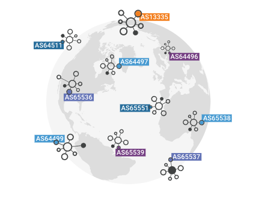

# AS

## What is an AS (autonomous system)?

The Internet is a global network of interconnected networks. In order for different networks to communicate with each other, they need to be interconnected via routers and other network devices. A single organization or entity manages and operates these networks, called autonomous systems (AS). Each autonomous system has a unique identity and a set of distinct routing policies. More specifically, an **autonomous system** (AS) is a large network or group of networks that has a unified routing policy. Every computer or device that connects to the Internet is connected to an AS.

## How important are ASs?

The AS is fundamental to the functioning of the global Internet. They allow different networks to connect and communicate with each other, forming a single global network that covers the whole world.

Each AS is responsible for managing traffic routing within its own network, as well as to other autonomous systems. Autonomous systems determine how to forward network traffic and which paths are preferred for different types of traffic through the routing policies they define.

In this way, autonomous systems allow companies and organizations to manage their own networks independently. You can then establish your own security, connectivity and traffic control policies. Therefore, this allows companies and organizations to have greater control over their network infrastructure and ensure that it meets their specific needs.

In short, ASs are fundamental to the functioning of the global Internet. They enable communication between different networks and ensure that network traffic is routed efficiently and reliably.

<figure><figcaption></figcaption></figure>

We can see ASNs in Brazil here: https://ipinfo.io/countries/br#section-asns
