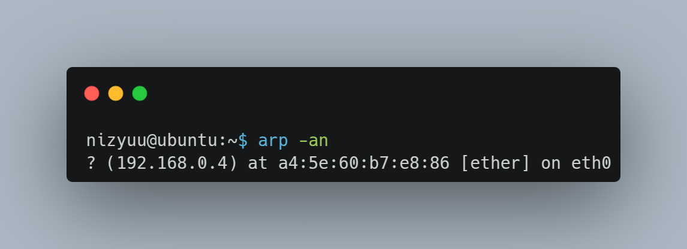
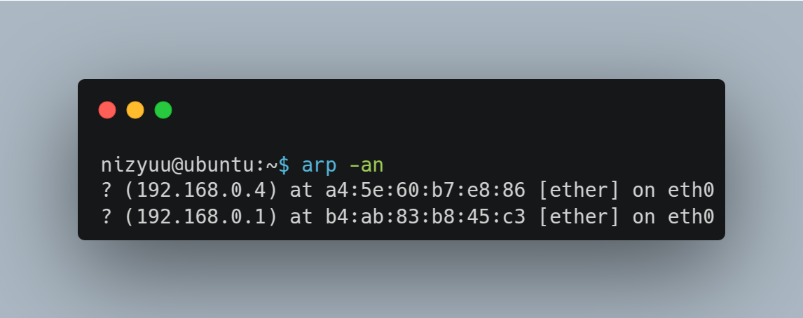

# ARP

ARP has the ability to find out which MAC address is associated with a particular IP address. This is important because before we can send something to a particular host that we know the IP address of, we need to know its MAC address.

This is where the ARP protocol and the famous ARP Request and ARP Reply come in.

**ARP Request** is used to make a request to every ethernet segment asking who has a particular IP and what their MAC is. Every ethernet segment is represented by ff:ff:ff:ff:ff:ff, so all the hosts on that segment will receive the ARP Request.

**ARP Reply** is the response sent by the host that has the IP requested by the ARP Request, in this reply the machine that has the information sends its Mac Address.

The host that receives the ARP Reply stores the IP and MAC address in its memory for a while. IP and MAC, so it doesn't need to reuse the ARP protocol because it already knows the IP and MAC. We can use this command to see the arp table.

<figure><figcaption></figcaption></figure>

The table above only shows the MAC address of the router, but for example, if any other machine on the local network tries to access this (web) server, our arp table will be updated automatically.

<figure><figcaption></figcaption></figure>

In order for computers to be able to communicate on the local network we need to know the MAC address, when an access from another IP (192.168.0.11) arrives at the server and it needs to respond to this communication then the server fires an ARP Request to find out the MAC of this host, when it receives the reply it updates the arp table as shown above.
