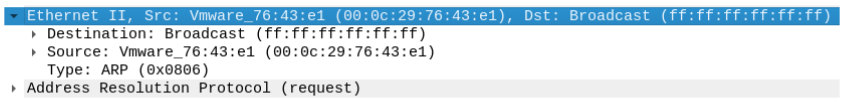

# Ethernet

The Ethernet protocol operates at layer 2 of the OSI model and is responsible for encapsulating the IP protocol in local networks. Encapsulation means that the ethernet payload (data area) can store other protocols such as the IP protocol.

The Ethernet protocol only knows physical addresses (Mac Address). The structure of an Ethernet frame is as follows:

<figure><figcaption></figcaption></figure>

* Destination Mac Address - contains the MAC address of the destination network interface. (_ff:ff:ff:ff:ff:ff_)
* Source Mac Address - contains the mac address of the source network interface (_00:0c:29:76:43:e1_)
* Type - contains the code that identifies the type of protocol that will be in the payload, 0800 for IP protocol and 0806 for ARP protocol. (_0806_)
* Payload - contains the data to be transported (another protocol), the maximum size of the ethernet payload is 1500 bytes (_ARP_)
* Checksum - Checks for errors.
