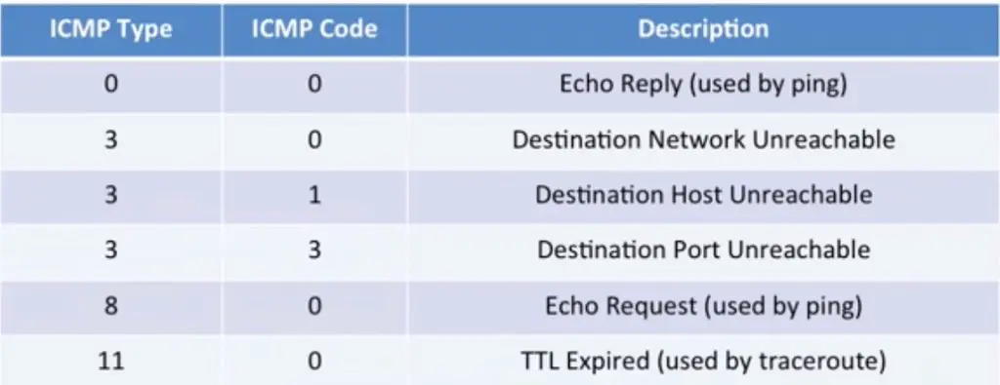
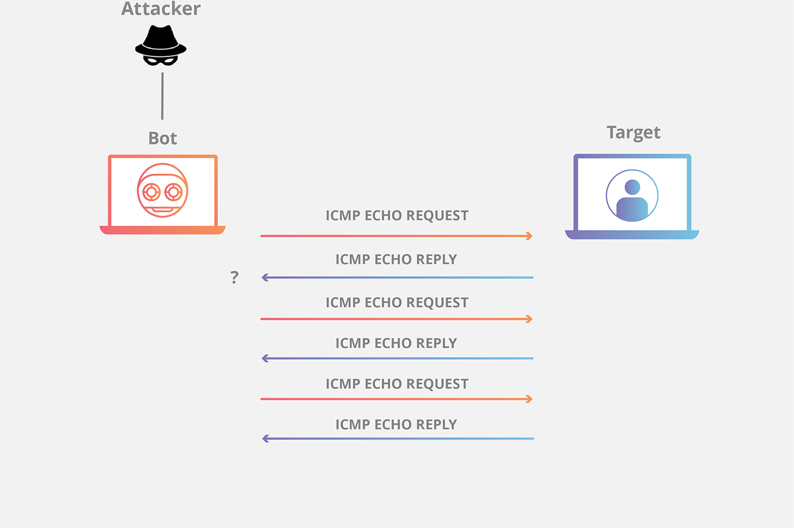

# ICMP

The Internet Control Message Protocol (ICMP) is a network layer protocol used by network devices to diagnose network communication issues. ICMP is mainly used to determine whether or not data is reaching its intended destination in a timely manner. Commonly, the ICMP protocol is used on network devices, such as routers. ICMP is crucial for error reporting and testing, but it can also be used in distributed denial-of-service (DDoS) attacks.

The basic ICMP structure of is simple, composed of types and codes, each with its own function.

<figure><figcaption></figcaption></figure>

ICMP types:

<figure><figcaption></figcaption></figure>

## What is ICMP used for?

The primary purpose of ICMP is for error reporting. When two devices connect over the Internet, the ICMP generates errors to share with the sending device in the event that any of the data did not get to its intended destination. For example, if a packet of data is too large for a router, the router will drop the packet and send an ICMP message back to the original source for the data.

A secondary use of ICMP protocol is to perform network diagnostics; the commonly used terminal utilities traceroute and ping both operate using ICMP. The traceroute utility is used to display the routing path between two Internet devices. The routing path is the actual physical path of connected routers that a request must pass through before it reaches its destination. The journey between one router and another is known as a "hop", and a traceroute also reports the time required for each hop along the way. This can be useful for determining sources of network delay.

Unfortunately network attacks can exploit this process, creating means of disruption such as the ICMP flood attack and the ping of death attack.

## How does ICMP work?

Unlike the Internet Protocol (IP), ICMP is not associated with a transport layer protocol such as TCP or UDP. This makes ICMP a connectionless protocol: one device **does not need to open a connection** with another device before sending an ICMP message. Normal IP traffic is sent using TCP, which means any two devices that exchange data will first carry out a TCP handshake to ensure both devices are ready to receive data. ICMP does not open a connection in this way. The ICMP protocol also does not allow for targeting a specific port on a device.

## How is ICMP used in DDoS attacks?

**ICMP flood attack**

A ping flood or ICMP flood is when the attacker attempts to overwhelm a targeted device with ICMP echo-request packets. The target has to process and respond to each packet, consuming its computing resources until legitimate users cannot receive service.

<figure><figcaption></figcaption></figure>

