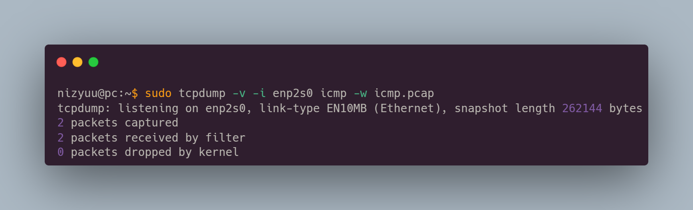
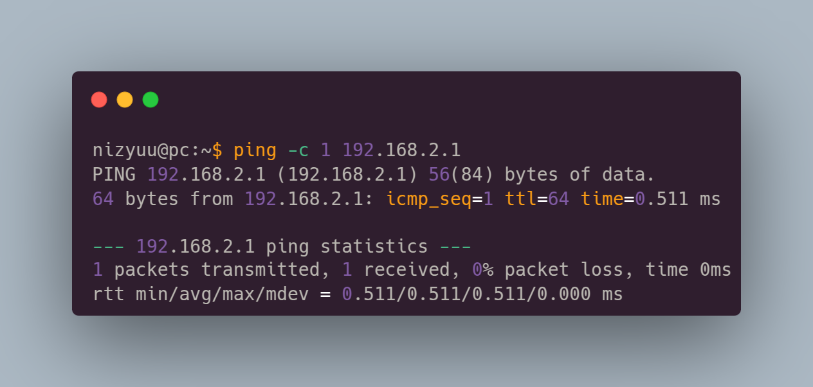
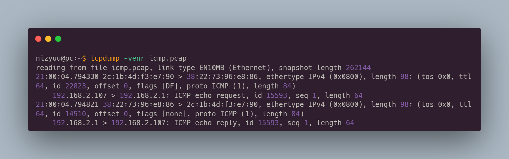

# Protocol Analyzers

A great command-line protocol analyzer is `tcpdump`.

You can capture traffic for a given protocol (e.g. icmp) using the following command:

```bash
$ sudo tcpdump -v -i enp2s0 icmp
```

If you want the capture to be saved to a file, we can use it like this:

<figure><figcaption></figcaption></figure>

<figure><figcaption></figcaption></figure>

<figure><figcaption></figcaption></figure>
