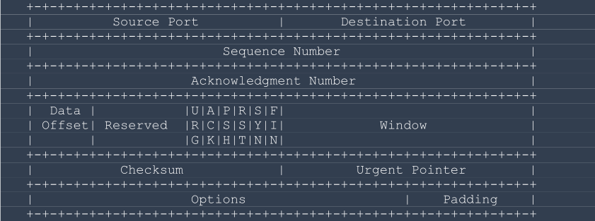
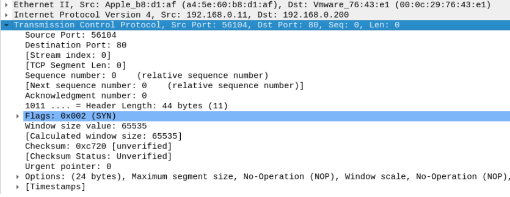
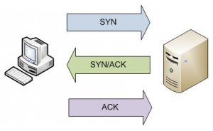

# TCP

The TCP protocol is considered a reliable protocol for data transmission because it guarantees the delivery of information. The TCP segment communicates with ports. Unlike the IP protocol, the TCP protocol will not always have a payload.

Let's learn about the structure of the TCP Header:

<figure><figcaption></figcaption></figure>

As we can see below, we have the Ethernet frame with the source being the client host and the destination being the server host.

Next we have the Internet Protocol Version 4 (IPv4 Protocol), we can see that the source is the IP address of the client host and the destination is the IP address of the server host.

<figure><figcaption></figcaption></figure>

And now we have the Transmission Control Protocol better known as TCP, let's analyze the TCP header information.

**Source port**: Shows the source port (ports can range from 0 to 65535)

**Destination Port**: Shows the destination port

**Sequence Number**: Identifies the TCP segment

**Acknowledgement**: Confirms the segment (knows what the sequence number of the next segment will be)

**Data offset**: size of the TCP header

**TCP flags**: URG, ACK, PSH, RST, SYN, FIN

**Windows (Windows size)**: determines the number of bytes that the next segment can have.

**Checksum**: checks the header and payload, as well as the IP header.

**Urgent Pointer**: When the URG flag is active, the content is placed at the beginning of the payload in order to prioritize it.

**Options**: used to add new features.

## Understanding TCP FLAGS

**SYN** – indicates synchronization, starting a connection between the parties involved.

**FIN** – indicates termination, i.e., the connection must be closed.

**RST** – indicates reset, i.e., when the communication is not understood or something is wrong.

**PSH** – Indicates that there is data in the TCP payload.

**ACK** – confirms that it knows what the next sequence number will be.

**URG** – Indicates urgency, i.e., the content must be prioritized.

## 3WHS - Three-way Handshake

TCP is connection-oriented, meaning that it only transmits if it is certain that a connection has been successfully established. The establishment of this initial connection is called a three-way handshake.

Three-way Handshake is the name given to the technique used to open a connection.

<figure><figcaption></figcaption></figure>

As we can see in the image above, before the client host exchanges information with the server host, the connection is established by performing the three-way handshake.

The client host sends the packet with the **SYN** flag indicating that it wants to synchronize (initiate a connection).

The server host sends a packet with the **SYN/ACK** flags as a response confirming the start of the connection.

The client host sends the packet with the **ACK** flag confirming, thus completing the three-way handshake and from then on the hosts begin exchanging information.
