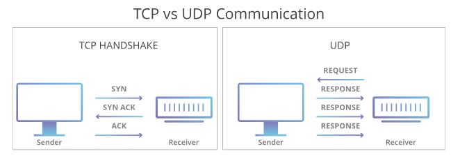

# UDP

The UDP protocol, like TCP, is a data transport protocol. However, it is not reliable because it does NOT guarantee data delivery. On the other hand, precisely because it does not have this control, it ends up being a much faster delivery protocol. Another detail is that it is not connection-oriented, that is, it is NOT necessary to establish a connection before starting to transmit.

Let's take a look at the UDP protocol header.

<figure><figcaption></figcaption></figure>

As we can see, the UDP protocol header is very simple, having only source and destination port, size and checksum.

<figure><figcaption></figcaption></figure>

In addition, TCP communications indicate the order in which data packets should be received and confirm that the packets arrived as expected. If a packet does not arrive, for example due to congestion on the intervening networks, TCP requires that it be resent. UDP communications do not include either of these features.

These differences create some advantages. Because UDP does not require a handshake or verification that the data arrived correctly, it is able to transfer data much more quickly than TCP.

## How is UDP used in DDoS attacks?

The “risks” of UDP, such as packet loss, are not a serious issue in most use cases. However, UDP can be exploited for malicious purposes. Because UDP does not require a handshake, attackers can “flood” a target server with UDP traffic without first obtaining that server’s permission to initiate communication.

<figure><figcaption></figcaption></figure>

A typical UDP flood attack sends a large number of UDP datagrams to random ports on your target computer. This forces the target to respond with an equally large number of ICMP packets, which indicate that these ports cannot be reached. The computing resources required to respond to each fraudulent datagram can exhaust the target, resulting in a denial of service for legitimate traffic.
