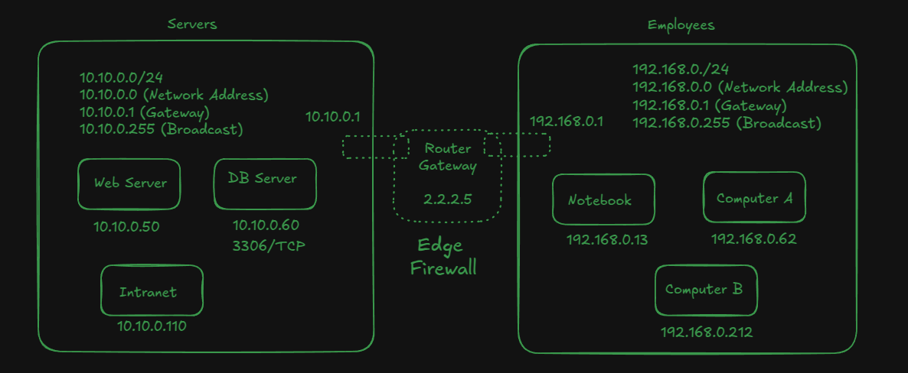
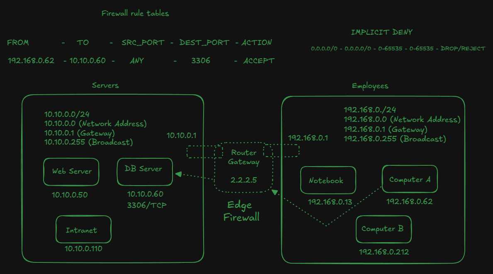
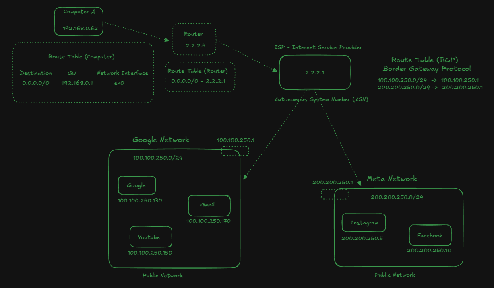
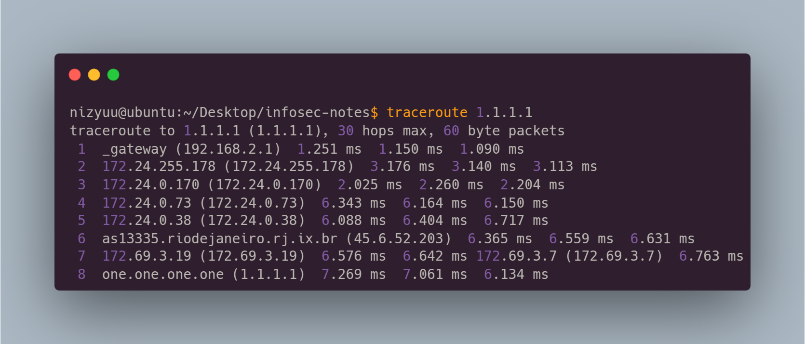

# Route

Routing is when a machine with multiple network connections decides where to deliver the IP packets it has received. So that the packets reach their destination.

## How does routing work?

The `192.168.0.1` network can't communicate with `10.10.0.0`, how does that work?

Different networks can communicate with each other through a Router. The router has interfaces that make this possible. In most cases, the router is the network gateway. So the gateway is responsible for a network `192.168.0.0` being able to communicate with another `10.10.0.0`.

"Computer A" wants to communicate with the Web Server `10.10.0.50`, but it does not have access to this network. Therefore, the gateway will be responsible for sending the packet to its network interface that has access to another network.

<figure><figcaption><p>192.168.0.62 (Computer A) -> 192.168.0.1 (Router)<br>192.168.0.1 (Router) -> 10.10.01 (Router)<br>10.10.01 (Router) -> 10.10.0.50 (Web Server)</p></figcaption></figure>

In the middle of this communication, there is a firewall, which basically works to control a network, allowing, denying or blocking access.

In this example below, we can “simulate” a rule in the firewall where "computer A" can access the database server because there is a rule in the firewall that allows this access.

<figure><figcaption></figcaption></figure>

Note: there is no reason to place any edge firewall rule within computers on the same network (e.g.: "Notebook" communicating with "Computer A") because this will not be filtered by the firewall, that is, communication is done directly between them.

Every computer has a routing table. If we can see the routing table, we can run this command below:

```
$ netstat -r
```

In order to access a specific network on the internet, such as the Google network, accessing the Google website itself, or Facebook, etc., we need an internet provider, we can call it an ISP (Internet Service Provider), which will do the work of connecting our network with other networks.

Our computer has a route table, in the example, `0.0.0.0/0` means all addresses, that is, everything that is accessed will be forwarded to the router `192.168.0.1`

When we make a request to Google, the router also doesn't know Google's address because it doesn't have it in its route table. Therefore, it will send the request to the provider (ISP).

The ISP will receive a notification from Google, so Google will notify the provider that if it wants to communicate with the `100.100.250.0/24` network, it needs to send the request to the Google network entry `100.100.250.1`

<figure><figcaption></figcaption></figure>

We call this communication between public networks **Autonomous Systems** (AS), because the communication is automatic, there is no one configuring **BGP**. However, this process is done through several routes, it is not directly from the provider to the Google network, we can trace the route with the command `traceroute`.

With the `traceroute` command, we can see all the IPs of the communication, from our computer until it reaches the destination IP, the communication passes through all of them. For example, we can see the communication with a Cloudflare server.

<figure><figcaption></figcaption></figure>

We can also use the website https://ipinfo.io/ to consult more about each one.

We can see all **Claro** networks, which is a provider on the website; https://bgp.he.net/AS4230#\_prefixes

**Claro** has direct connection with several networks: https://bgp.he.net/AS4230#\_peers

For an **AS** to connect with another **AS** (e.g.: the provider's AS to connect with Google's AS), there must be a direct connection, with a cable. There are a fiber optic cables coming from here and connecting there.

## NAT (Network Address Translation)

Our router plays a very important role called **NAT**. We've talked how it works to send a request to Google, but how does Google know where it has to return the packet? Since our IP `192.168.0.63` is a **private network**, it is necessary to translate the internal IP of our network to a **public** **IP**. The internet provider provides a public IP address, usually one address per house.

<figure><figcaption></figcaption></figure>

#### Why does NAT exist?

In the past, all devices, including internal network devices, had public addresses, meaning that anyone on the Internet could access your computer within your internal network. As a result, the number of IP addresses would not be sufficient, and the maximum number was reached.

Therefore, the idea was to assign a single IP address to each network (home), and NAT was used to translate the addresses from the private network to a public network.
