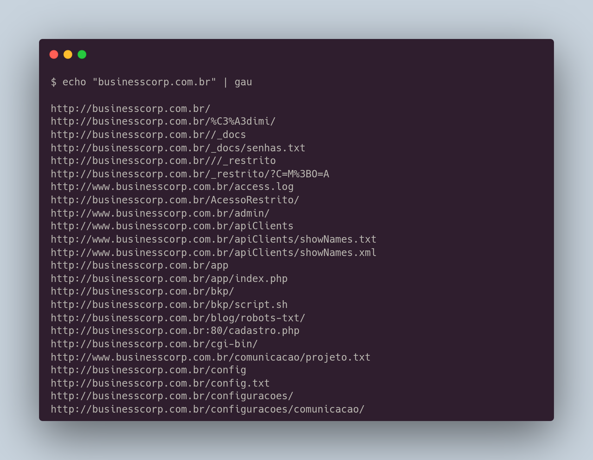
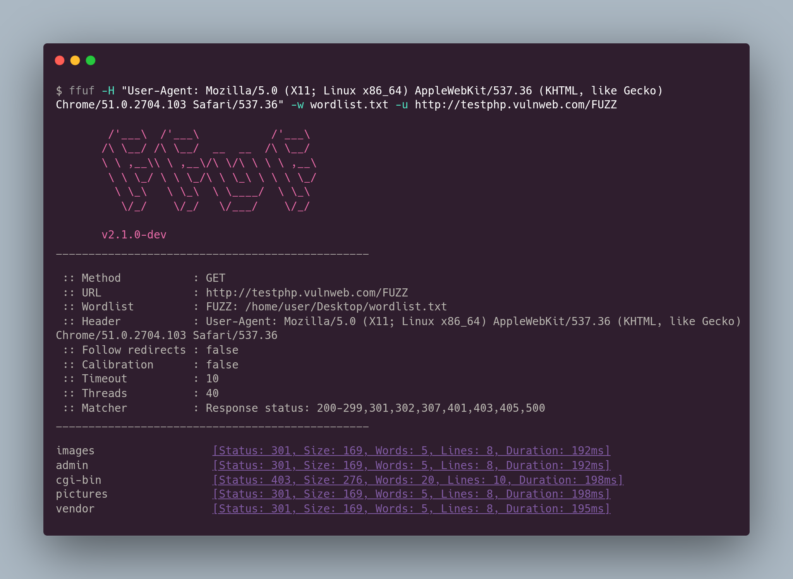
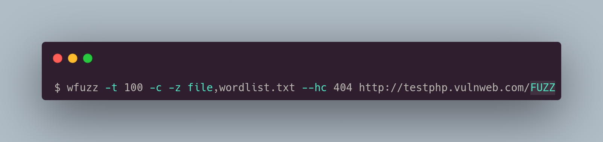
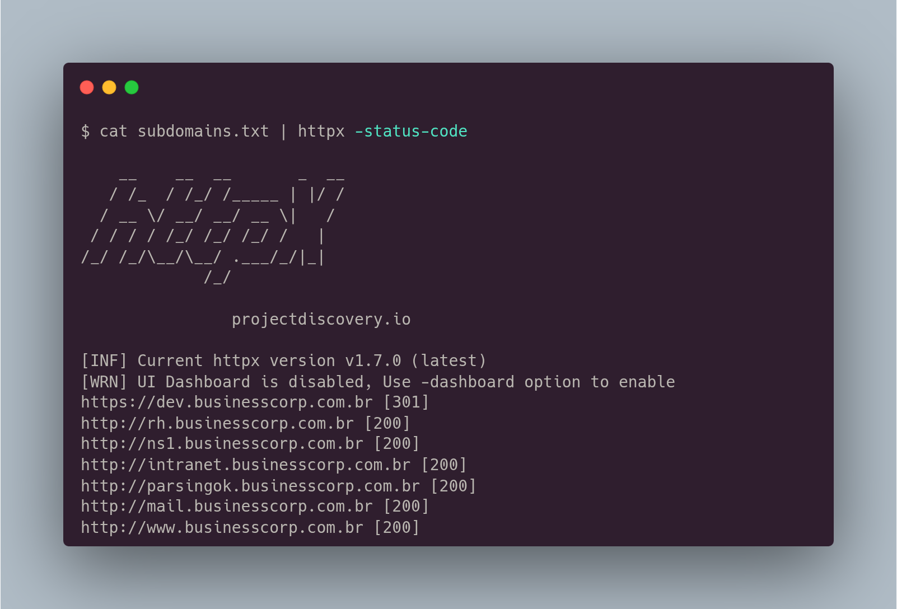
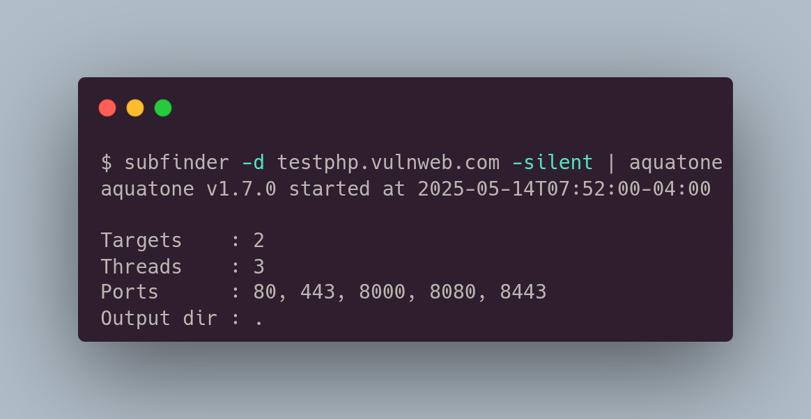
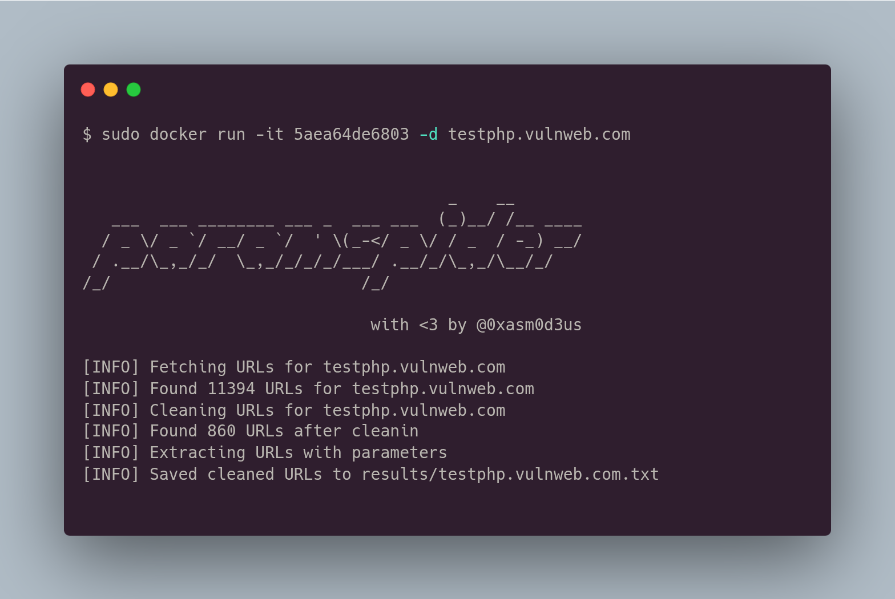
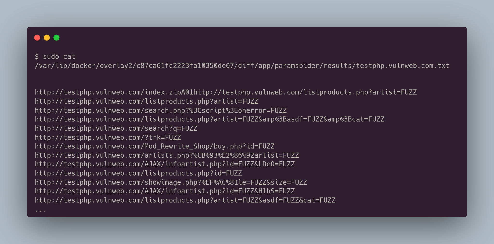
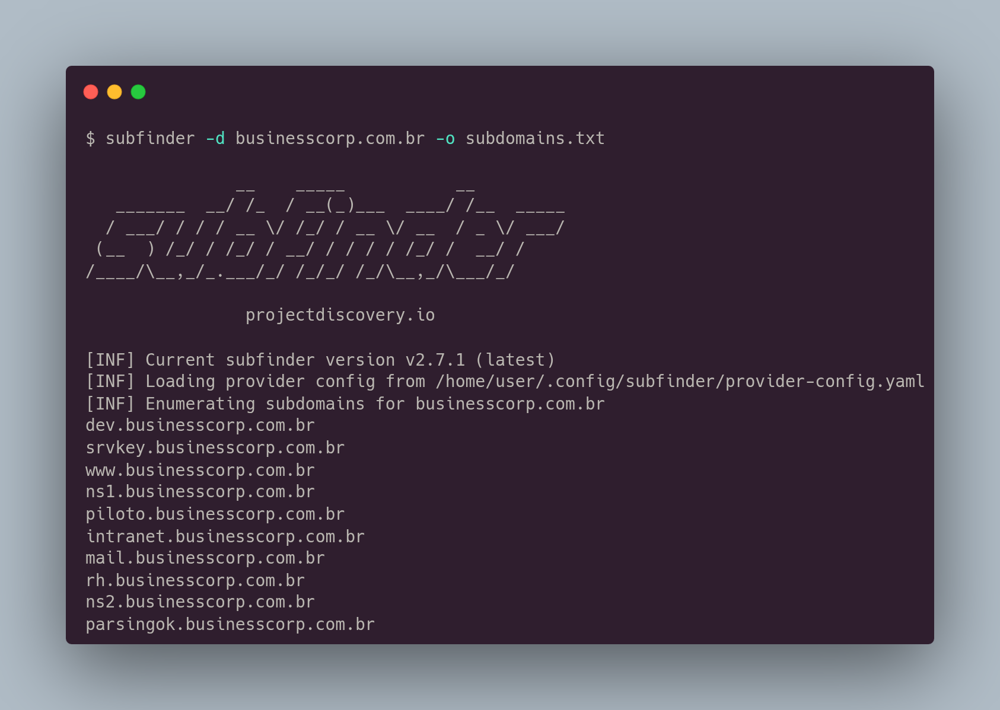
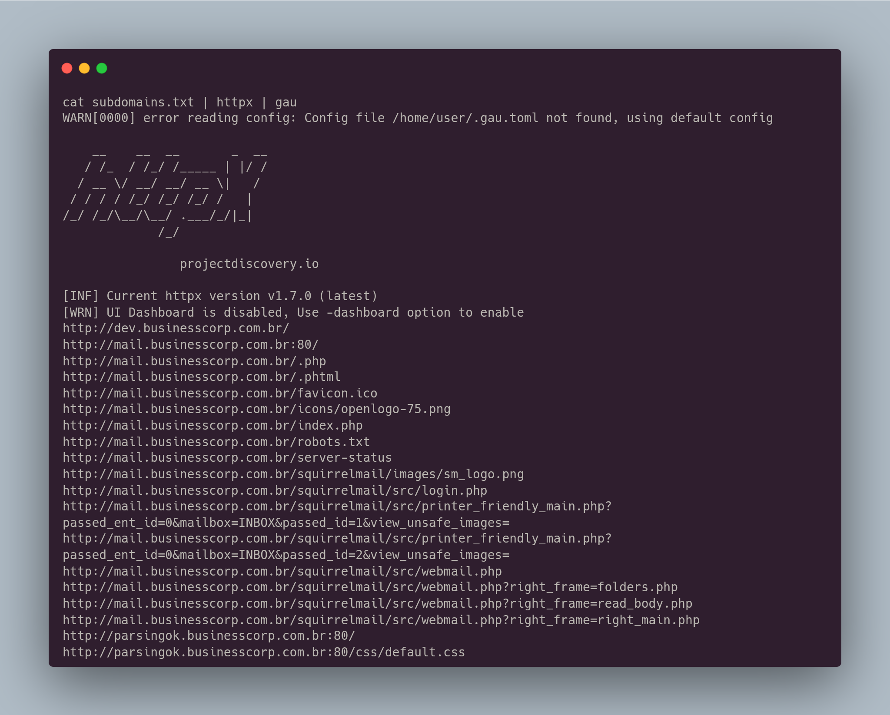
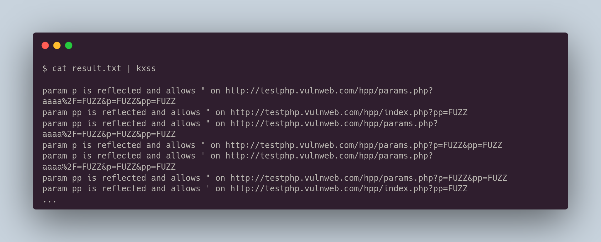

# Application Discovery

## URL Discovery

Para fazermos uma busca por arquivos e diretórios, podemos utilizar algumas ferramentas para fazer o `fuzzing`.

### Gau

O gau utiliza motores de pesquisa (ex: google, shodan, censys, waybackmachine), compila essas informações e nos retorna as urls que foi descobertas nessas buscas.

<figure><figcaption></figcaption></figure>



### ffuf

https://github.com/ffuf/ffuf

<figure><figcaption></figcaption></figure>

### wfuzz

<figure><figcaption></figcaption></figure>



## Content Discovery

### httpx

<figure><figcaption></figcaption></figure>



### Aquatone

<figure><figcaption></figcaption></figure>



## Parameter Discovery

### Param Spider

Podemos rodar o param spider usando o docker, para conseguirmos achar parâmetros em uma aplicação

<figure><figcaption></figcaption></figure>

O resultado:

<figure><figcaption></figcaption></figure>



## Unindo ferramentas

Podemos primeiro enumerar os subdomínios da aplicação com o subfinder

<figure><figcaption></figcaption></figure>

Depois usamos o httpx para fazer uma conexão em cada subdóminios e verificar se está ativo ou não.\
Podemos usar o parâmetro -path para testar diretórios que quisermos, exemplo: `-path /admin/`&#x20;

<figure><figcaption></figcaption></figure>

E agora podemos unir com o gau para descobrir quais urls existem dentro de cada subdomínio.

<figure><figcaption></figcaption></figure>

Podemos usar o kxss para buscar por parâmetros (retornados no param spider)que são refletidos e com isso acharmos alguma falha de XSS.

<figure><figcaption></figcaption></figure>


