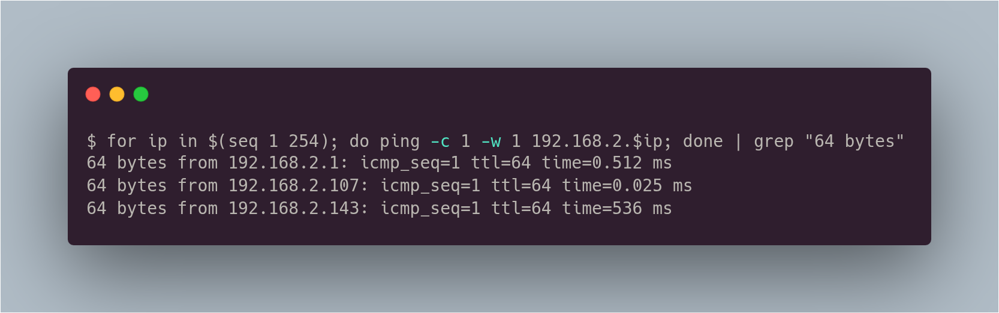
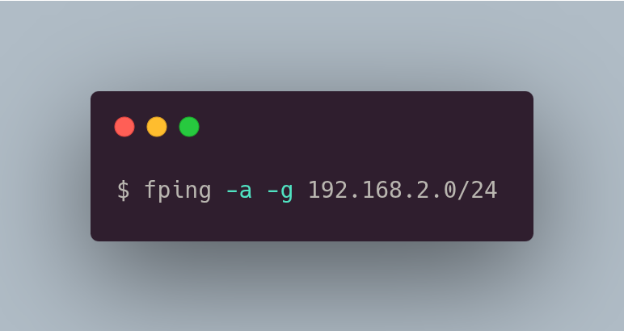

# Ping Sweep

O ping sweep é uma técnica para descobrir hosts ativo em uma rede. No exemplo a seguir, ao tentarmos pingar no primeiro endereço IP, ele responde corretamente, ou seja, está ativo. Já no segundo não houve resposta. Caso não haja resposta, pode ser que o firewall esteja bloqueando ou possa ser que ele não exista.

<figure><figcaption></figcaption></figure>

Podemos também automatizar isso.

<figure><figcaption></figcaption></figure>

O `fping` é outra forma de scanear a rede de uma forma muito rápida e prática.

Utiliza-se da seguinte forma

<figure><figcaption></figcaption></figure>

_Vale lembrar que essa técnica não é eficaz quando do outro lado há um firewall que dropa ou rejeita pacotes ICMP (visto que o ping utiliza o ICMP)._
