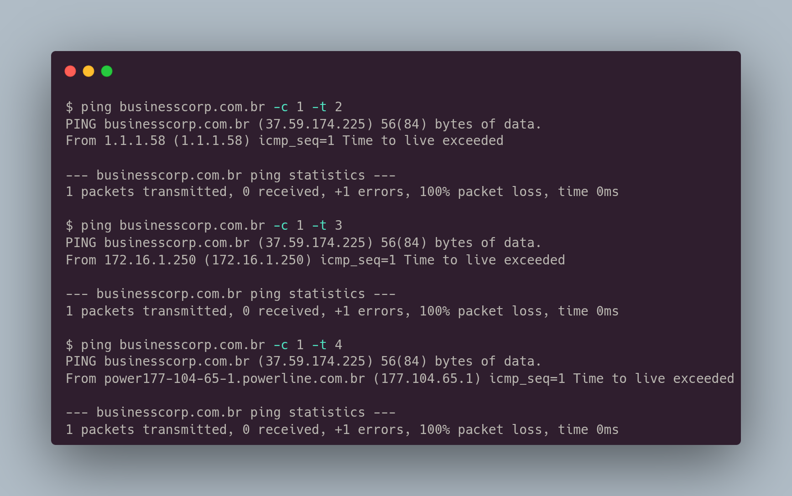
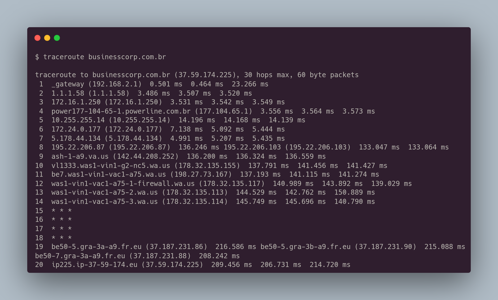

# Tracking the Route

O tracking the route é uma técnica que permite visualizar toda a rota que os pacotes fazem até chegar ao destino. Cada vez que o pacote é passado para um roteador, é diminuído "1" no seu TTL (time to live). Linux tem 64 de TTL e Windows possui 128 por padrão. Podemos manipular os pacotes utilizando o **ping** passando como parâmetro -t para indicar o valor do TTL.

<figure><figcaption></figcaption></figure>

O **traceroute**, é ferramenta que é capaz de mostrar toda a rota do pacote até chegar ao alvo.

<figure><figcaption></figcaption></figure>

O traceroute utiliza o protocolo UDP por padrão. Se o host não aceita o protocolo UDP, podemos utilizar o ICMP ou TCP, passando como parâmetro **-I** e **-T** respectivamente.
