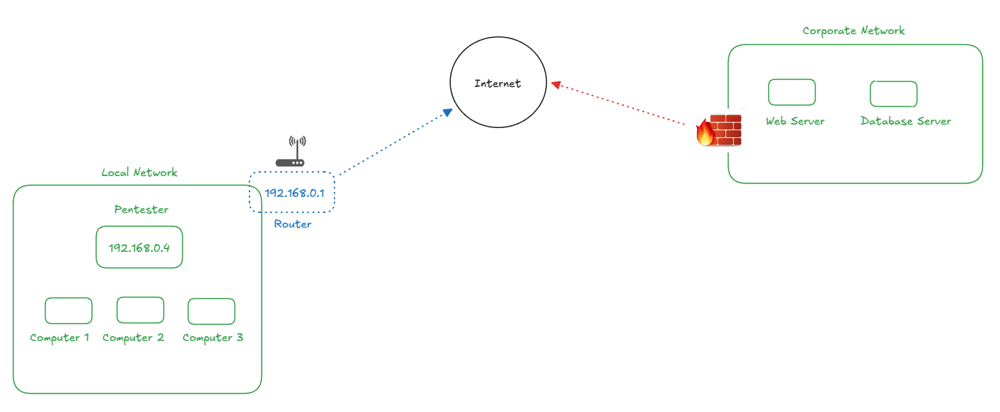

# Port Forwarding

**Port forwarding** is a network configuration technique that redirects incoming network traffic from one port to another.

We need to know what port forwarding is. In the following image we can see the scenario where we are in a local network and we have a router that allows us to access the internet. The router connects to the provider and provides us a public IP address fro all machines on the network to access the internet. It can be a dynamic IP or a static IP, depending on the provider.

Let's suppose we need to open a port to get a `reverse shell`. Once we open a port, 443 for example, and we want to a target connects itself to this port through a public IP, it's probably that this service is not available, because it wasn't made the port forwarding. Port forwarding is used so that as soon as the packet arrives at the router, it knows to direct the packet to the correct IP that has the port open.

Considering that we have managed to compromise a server that has a edge firewall. We want to open a port on that server to connect directly to it through our computer. Because of the firewall, we cannot connect directly because it does not allow and blocks access. Therefore, the solution is to make a reverse connection. We open a port on our computer and make the server connect to our machine, since the firewall has outgoing ports that it releases. For this to work, it is necessary to have port forwarding working.

<figure><figcaption></figcaption></figure>

This will depend a lot on which provider we use, how many routers you have in the way (in which case we would have to have access to all the routers to apply the correct configuration). And even then, the provider may block it.

Another solution is to use a VPS (Virtual Private Network). We can rent a server in the cloud, and with this we can open a port that will be exposed to the internet, so we don't need to configure the router.
