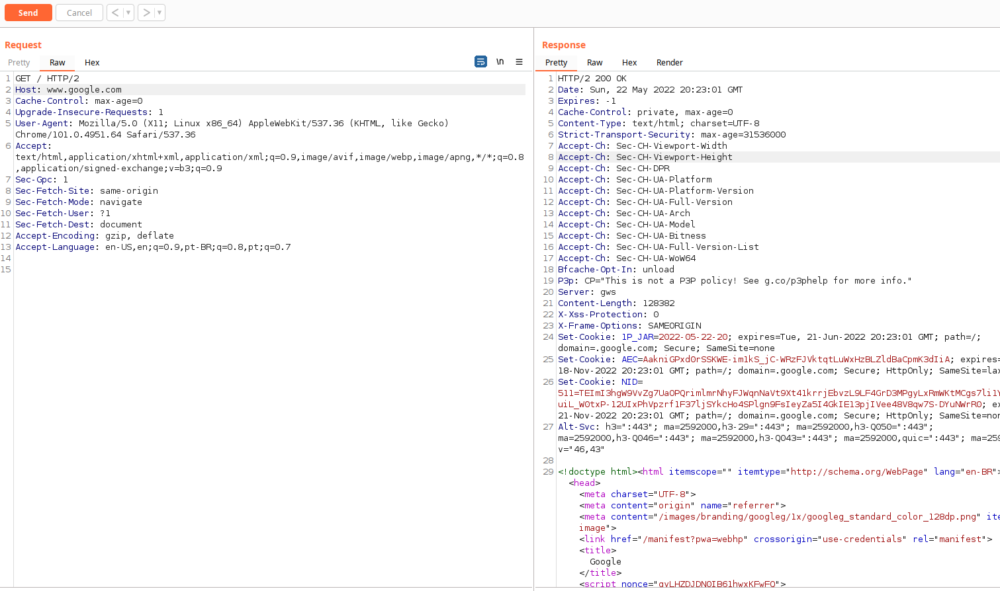
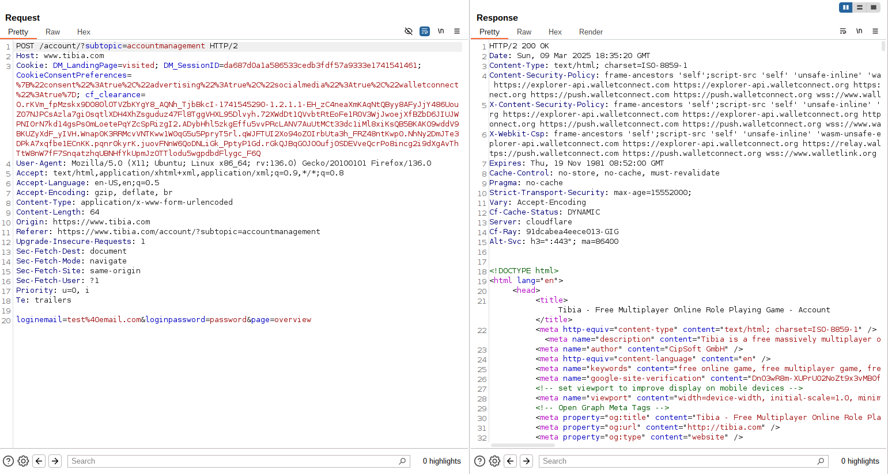

# HTTP

The HTTP protocol is responsible for web communications between client and server. The client sends the HTTP request and the server responds with the HTTP response.

HTTP consists of the request header and the body, which are separated by a blank line (if it is a POST request and has a body). By default, when we access a web page, the request method is GET.

In this example below, I used a proxy called Burpsuite to intercept the request between a client (a browser, in this case) and a server, so we can better visualize how it works.

<figure><figcaption></figcaption></figure>

A GET request was made to google.com. Note that line 14 is blank. As previously stated, the HTTP protocol works this way. This blank line is necessary to separate the header from the body. In this case, since it was a GET request, there is no body to be sent.

Now, let's submit a login form to a website to test how a post request works.

<figure><figcaption></figcaption></figure>

To communicate from the front-end to the back-end, the HTTP protocol uses HTTP methods. They are:

GET -> Read data from the server POST -> Send data to the server PUT -> Send data to the server (create/update) DELETE -> Delete data from the server PATCH -> Update data on the server.

For every HTTP request we make to the server, it will respond with a status code. Each status code has a meaning. These are some of them:

<figure><figcaption></figcaption></figure>
