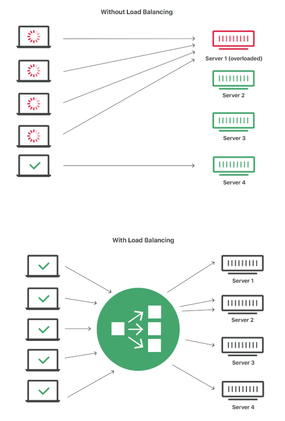

# Load Balancer

There are servers that receive thousands of requests, so a single server would not be able to handle all those requests and would not work. To prevent this server from going offline with a significant amount of access, we have a technology called Load Balancer. Basically, it makes a copy of an application and distributes it to other servers. Each server will have a copy, thus directing traffic to each server. This way, if one of them stops working, there will be another that can perform the same function, thus keeping the application always available. This helps to maximize the availability of a website, reducing server overload and eliminating hardware-related costs.

<figure><figcaption></figcaption></figure>

In terms of web exploration, the Load Balancer can be a problem if we find a way to send a malicious file to the server, because at a certain point, the Load Balancer can redirect us to another server, thus not containing the file that was uploaded. So it is always important to know if an application is using this technology.
