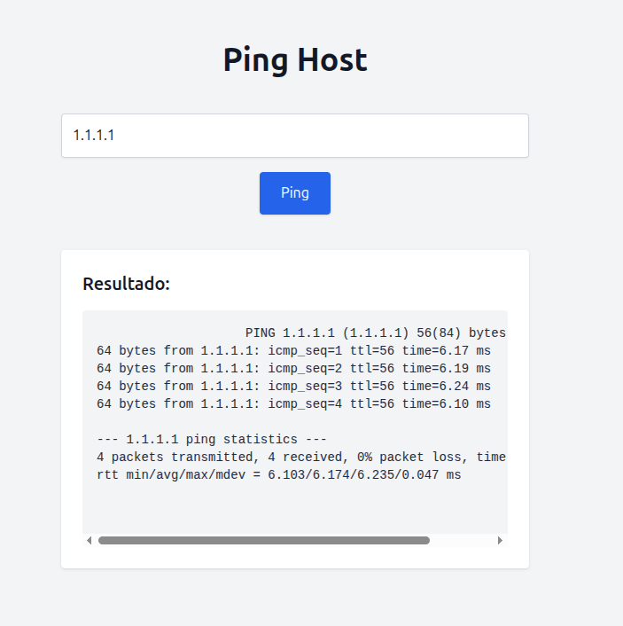
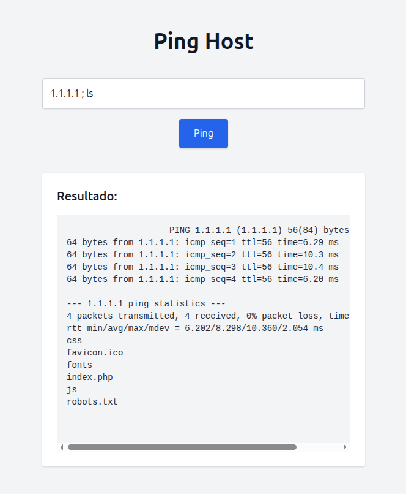

# Command Injection

O command injection é uma vulnerabilidade web que permite que seja executado um comando do sistema operacional no servidor que está rodando a aplicação. Vamos supor que exista uma parte da aplicação que executa um **whois** em determinado site. Se não existir um filtro adequado do lado do backend, isso pode facilmente ser explorado.

Vamos supor que uma aplicação web possui um página que basicamente faz o ping para um determinado host/ip, se não tiver algum tratamento ou filtro é possível concatenar algum outro comando para que seja executado. Ou seja, além do comando `ping` que será executado, podemos concatenar com `;` `|` ou `&&` para bypassar.

<figure><figcaption></figcaption></figure>

Como podemos ver, ao passarmos um IP, a aplicação está executando o comando `ping` enviando 4 pacotes para o alvo. Agora podemos aproveitar disso para executar outro comando que não é esperado, vamos tentar utilizar o `ls` para listar o conteúdo dos arquivos diretamente no servidor.

<figure><figcaption></figcaption></figure>

Conseguimos executar o comando com sucesso. Podemos ver que o código no backend está da seguinte forma.

```php
$command = "ping -c 4 " . $request->host;
```

No final, o comando concatenado ficará assim, sendo totalmente válido.

```
ping -c 4 1.1.1.1 ; ls
```

Outro exemplo, é o código abaixo onde após o `ping`, é feito um `grep` para pegar apenas as linhas que contém o conteúdo "64 bytes".

```php
$command = "ping -c 4 " . $request->host . " | grep '64 bytes'";
```

Assim, se utilizarmos daquela forma, o comando final ficará assim, não sendo possível executar o `ls`.

```
ping -c 4 1.1.1.1 ; ls | grep '64 bytes'
```

Para resolver isso, podemos utilizar o caractere `#` para comentar tudo que vem depois, sendo uma forma de bypassar.

```
ping -c 4 1.1.1.1 ; ls # | grep '64 bytes'
```
