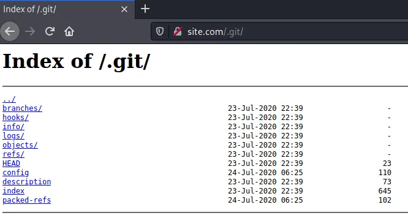

# Git Exposed

Essa falha permite que o atacante tenha acesso ao código fonte da aplicação através de uma falha de configuração. Isso ocorre quando alguém sobe a pasta `.git` para o ambiente de produção, essa pasta nunca deve ir para o servidor de produção. Com isso, todas as alterações que foram feitas no código, poderá ser lida por alguma pessoa má intencionada que conseguiu acesso a essa pasta.

<figure><figcaption></figcaption></figure>

Uma vez que identificamos que a aplicação tem a pasta `.git` exposta, podemos utilizar a ferramenta `git-dumper` para facilitar o processo e baixar esse diretório para nossa máquina local.

```
$ git clone https://github.com/arthaud/git-dumper
$ pip3 install -r requirements.txt
$ python3 git_dumper.py <url> <new-folder>
```

Após isso, é interessante utilizar o comando `git log` para ver todas as modificações que os desenvolvedores fizeram e `git show <hash>` para ver melhor os detalhes de cada arquivo.
