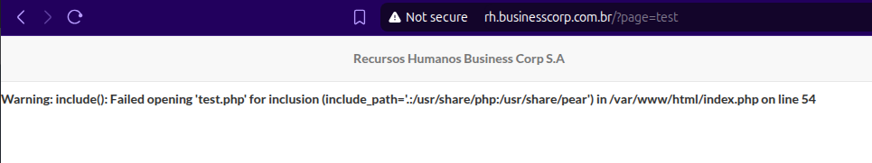

# LFI - Local File Inclusion

Essa vulnerabilidade ocorre quando a aplicação permite que o usuário inclua algum arquivo. Vamos supor que no código fonte há um include que pega por parâmetro via GET e inclui esse arquivo.

```
include($_GET['file']);
```

## De LFI a RCE - Infecção de Logs

Uma vez que conseguimos visualizar arquivos do lado do servidor, podemos aproveitar disso para conseguir uma RCE através da leitura dos arquivos de logs infectando o mesmo com algum código malicioso.

Podemos então enviar uma requisição para o servidor (caso a aplicação seja em php) da seguinte forma:

```
http://vuln.app/<?php system($_GET['shell']); ?>
```

Com isso, ao lermos o arquivo de log, podemos ver o código que inserimos. Como estamos através do LFI, e essa página interpreta o PHP, ele encontra o nosso código em PHP no log e tenta executar o comando que enviamos.

## PHP Wrappers

PHP Wrappers allows users to interact with various i/o streams including file io. It can be used to get content of a file preventing the server from executing it.

* [file://](https://www.php.net/manual/en/wrappers.file.php) — Accessing local filesystem
* [http://](https://www.php.net/manual/en/wrappers.http.php) — Accessing HTTP(s) URLs
* [ftp://](https://www.php.net/manual/en/wrappers.ftp.php) — Accessing FTP(s) URLs
* [php://](https://www.php.net/manual/en/wrappers.php.php) — Accessing various I/O streams
* [zlib://](https://www.php.net/manual/en/wrappers.compression.php) — Compression Streams
* [data://](https://www.php.net/manual/en/wrappers.data.php) — Data (RFC 2397)
* [glob://](https://www.php.net/manual/en/wrappers.glob.php) — Find pathnames matching pattern
* [phar://](https://www.php.net/manual/en/wrappers.phar.php) — PHP Archive
* [ssh2://](https://www.php.net/manual/en/wrappers.ssh2.php) — Secure Shell 2
* [rar://](https://www.php.net/manual/en/wrappers.rar.php) — RAR
* [ogg://](https://www.php.net/manual/en/wrappers.audio.php) — Audio streams
* [expect://](https://www.php.net/manual/en/wrappers.expect.php) — Process Interaction Streams

Em aplicações mais antigas onde é adicionado uma extensão no final do arquivo, podemos fazer o bypass adicionando o null byte `%00` para burlarmos essa extensão e visualizar o arquivo. Porém em aplicações mais modernas isso não é possível, nesse caso podemos em aplicações PHP utilizar o PHP Wrapper para lidarmos com essa situação.

Vamos pegar esse exemplo dessa aplicação que adiciona a extensão `.php` no final do arquivo que é passado pelo parâmetro `page`. Se passarmos o parâmetro `test`, irá ficar dessa forma:

<figure><figcaption></figcaption></figure>

Agora, utilizando o PHP Wrapper `data://`, conseguimos burlar isso:

<figure><figcaption></figcaption></figure>

Podemos também encodar em base64:

```
$ echo -n "test" | base64 
dGVzdA==
```

<figure><figcaption></figcaption></figure>

Com isso, nós conseguimos também executar comandos do sistema operacional:

```
$ echo -n "<?php system('id'); ?>" | base64
PD9waHAgc3lzdGVtKCdpZCcpOyA/Pg==
```

<figure><figcaption></figcaption></figure>
