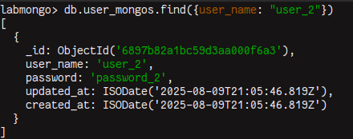
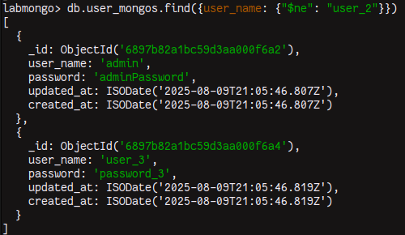
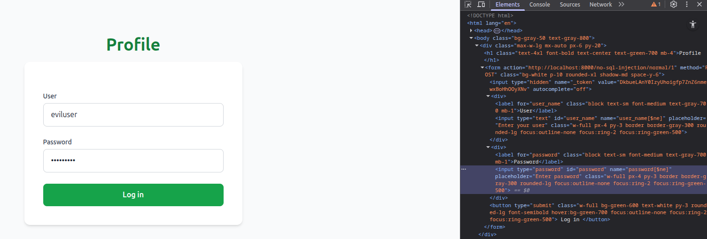
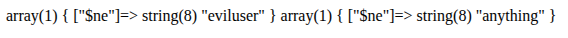
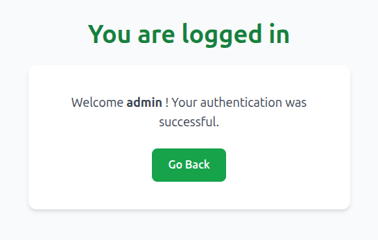
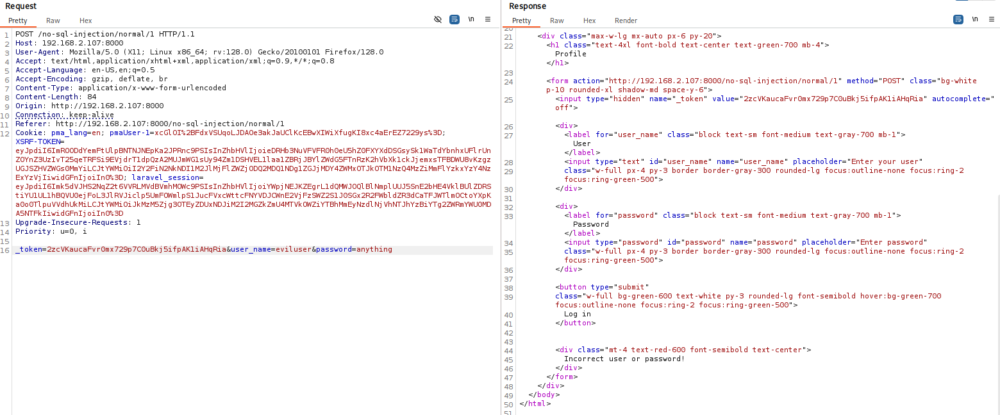
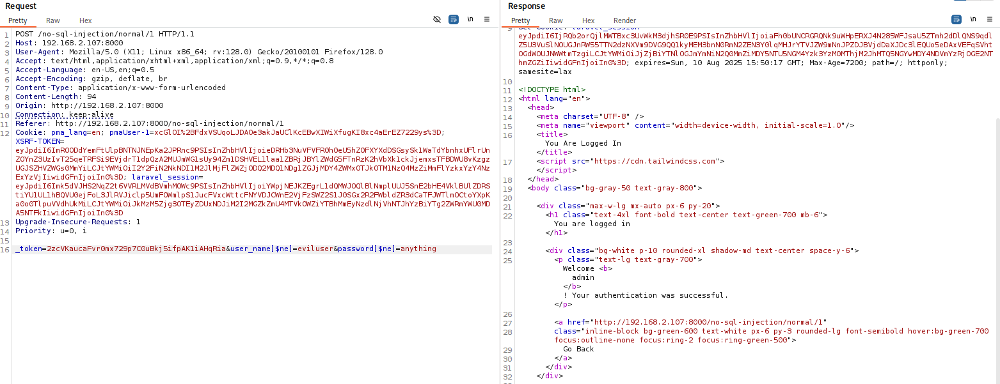

# NoSQL Injection

NoSQL injection is a vulnerability where an attacker is able to interfere with the queries that an application makes to a NoSQL database. NoSQL injection may enable an attacker to:

* Bypass authentication or protection mechanisms.
* Extract or edit data.
* Cause a denial of service.
* Execute code on the server.

NoSQL databases store and retrieve data in a format other than traditional SQL relational tables. They use a wide range of query languages instead of a universal standard like SQL, and have fewer relational constraints.

## Types of NoSQL injection

There are two different types of NoSQL injection:

* Syntax injection - This occurs when you can break the NoSQL query syntax, enabling you to inject your own payload. The methodology is similar to that used in SQL injection. However the nature of the attack varies significantly, as NoSQL databases use a range of query languages, types of query syntax, and different data structures.
* Operator injection - This occurs when you can use NoSQL query operators to manipulate queries.

## NoSQL operators

NoSQL databases often use query operators, which provide ways to specify conditions that data must meet to be included in the query result. Examples of MongoDB query operators include:

### Comparasion

| Name                                                                                              | Description                                                         |
| ------------------------------------------------------------------------------------------------- | ------------------------------------------------------------------- |
| [`$eq`](https://www.mongodb.com/docs/manual/reference/operator/query/eq/#mongodb-query-op.-eq)    | Matches values that are equal to a specified value.                 |
| [`$gt`](https://www.mongodb.com/docs/manual/reference/operator/query/gt/#mongodb-query-op.-gt)    | Matches values that are greater than a specified value.             |
| [`$gte`](https://www.mongodb.com/docs/manual/reference/operator/query/gte/#mongodb-query-op.-gte) | Matches values that are greater than or equal to a specified value. |
| [`$in`](https://www.mongodb.com/docs/manual/reference/operator/query/in/#mongodb-query-op.-in)    | Matches any of the values specified in an array.                    |
| [`$lt`](https://www.mongodb.com/docs/manual/reference/operator/query/lt/#mongodb-query-op.-lt)    | Matches values that are less than a specified value.                |
| [`$lte`](https://www.mongodb.com/docs/manual/reference/operator/query/lte/#mongodb-query-op.-lte) | Matches values that are less than or equal to a specified value.    |
| [`$ne`](https://www.mongodb.com/docs/manual/reference/operator/query/ne/#mongodb-query-op.-ne)    | Matches all values that are not equal to a specified value.         |
| [`$nin`](https://www.mongodb.com/docs/manual/reference/operator/query/nin/#mongodb-query-op.-nin) | Matches none of the values specified in an array.                   |

### Logical

| Name                                                                                              | Description                                                                                               |
| ------------------------------------------------------------------------------------------------- | --------------------------------------------------------------------------------------------------------- |
| [`$and`](https://www.mongodb.com/docs/manual/reference/operator/query/and/#mongodb-query-op.-and) | Joins query clauses with a logical `AND` returns all documents that match the conditions of both clauses. |
| [`$not`](https://www.mongodb.com/docs/manual/reference/operator/query/not/#mongodb-query-op.-not) | Inverts the effect of a query predicate and returns documents that do _not_ match the query predicate.    |
| [`$nor`](https://www.mongodb.com/docs/manual/reference/operator/query/nor/#mongodb-query-op.-nor) | Joins query clauses with a logical `NOR` returns all documents that fail to match both clauses.           |
| [`$or`](https://www.mongodb.com/docs/manual/reference/operator/query/or/#mongodb-query-op.-or)    | Joins query clauses with a logical `OR` returns all documents that match the conditions of either clause. |

## Using NoSQL operators to exploit

First, we need to understand how we can retrieve a data in NoSQL database. Here's how we do it:

<figure><figcaption></figcaption></figure>

We can also retrieve users other than "user\_2" using the comparison operator `$ne`, that is, it will return all users except this one.

<figure><figcaption></figcaption></figure>

The application expects the `user_name` input field to be a string. However, when we change it (either in the browser using devtools or using a proxy) to treat this field as an array, the application will receive this information as an array and consider the key and value. Let's change it in devtools and see how the information is received in the backend.

<figure><figcaption></figcaption></figure>

<figure><figcaption></figcaption></figure>

This way, we can inject the `$ne` operator to check if the application is vulnerable and return some value.

<figure><figcaption></figcaption></figure>

We can confirm that the application is vulnerable to NoSQL injection! We were able to log in with the "admin" user because it's the first user in the `users` table.

In JSON messages, you can insert query operators as nested objects. For example, `{"user_name":"user_2"}` becomes `{"user_name":{"$ne":"non_existent_user"}}`.

For URL-based inputs, you can insert query operators via URL parameters. For example, `user_name=user_2` becomes `user_name[$ne]=non_existent_user`. Let's use a proxy.

<figure><figcaption></figcaption></figure>

<figure><figcaption></figcaption></figure>

