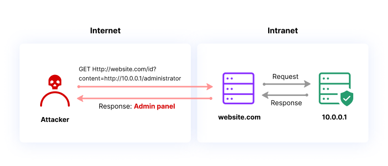
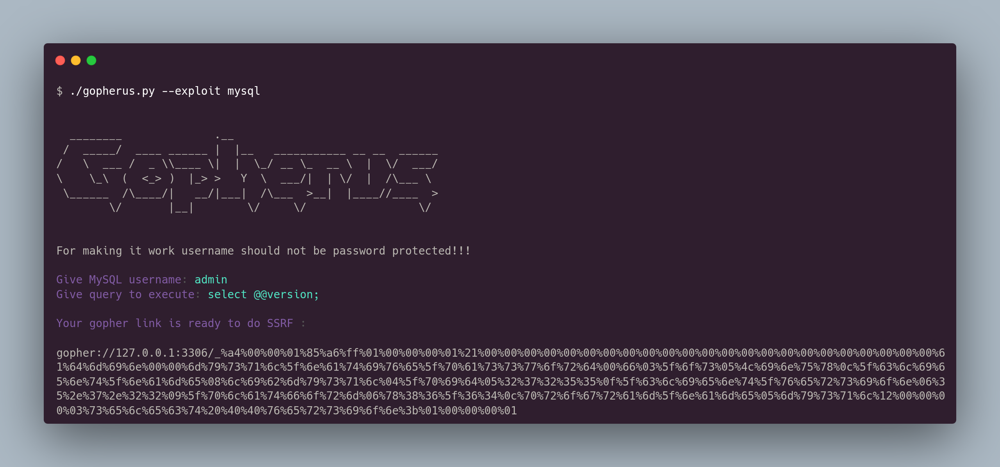

# SSRF (Server-side Request Forgery)

Server Side Request Forgery (SSRF) occurs when an attacker can create requests from the vulnerable server to the internet. Typically, the vulnerable server has a functionality that reads data from a URL, publishes data to a URL, or imports data from a URL. An attacker could abuse this functionality to read or update internal resources, or bypass access controls like firewalls that prevent the attackers from accessing them directly.

<figure><figcaption></figcaption></figure>

## SSRF attacks against the server

In an SSRF attack against the server, the attacker causes the application to make an HTTP request back to the server that is hosting the application, via its loopback network interface. This typically involves supplying a URL with a hostname like `127.0.0.1` (a reserved IP address that points to the loopback adapter) or `localhost` (a commonly used name for the same adapter).

For example, imagine a shopping application that lets the user view whether an item is in stock in a particular store. To provide the stock information, the application must query various back-end REST APIs. It does this by passing the URL to the relevant back-end API endpoint via a front-end HTTP request. When a user views the stock status for an item, their browser makes the following request:

```
POST /product/stock HTTP/1.0 

Content-Type: application/x-www-form-urlencoded 

Content-Length: 118 

stockApi=http://stock.weliketoshop.net:8080/product/stock/check%3FproductId%3D6%26storeId%3D1
```

This causes the server to make a request to the specified URL, retrieve the stock status, and return this to the user.

In this example, an attacker can modify the request to specify a URL local to the server:

```
POST /product/stock HTTP/1.0 

Content-Type: application/x-www-form-urlencoded 

Content-Length: 118 

stockApi=http://localhost/admin
```

The server fetches the contents of the `/admin` URL and returns it to the user.

An attacker can visit the `/admin` URL, but the administrative functionality is normally only accessible to authenticated users. This means an attacker won't see anything of interest. However, if the request to the `/admin` URL comes from the local machine, the normal access controls are bypassed. The application grants full access to the administrative functionality, because the request appears to originate from a trusted location.

## Protocol Smuggling

Existe uma técnica que é o `Protocol Smuggling`, que é basicamente uma técnica para acessar serviços internos através do SSRF. Geralmente, quando encontramos um SSRF em uma aplicação, ele realiza uma requisição utilizando o protocolo HTTP para a URL informada pelo usuário. O protocolo HTTP contém diversos headers, como o exemplo abaixo:

<div data-full-width="false"><figure><figcaption></figcaption></figure></div>

Como vamos acessar serviços internos que comunicam via socket através do SSRF? Para isso podemos utilizar o protocolo `gopher`, que se comunica com raw sockets. Se abrirmos um socket na porta 1337 e fazermos uma requisição utilizando o protocolo `gopher`, conseguiremos interagir com o socket. Veja no exemplo abaixo:

Primeiro vamos utilizar o netcat para ouvir na porta 1337 e receber a conexão.

```
$ nc -nlvp 1337
```

Agora, vamos utilizar o `gopher` para enviar uma informação `hello` para a conexão que está ouvindo na porta 1337. Lembrando que precisamos montar a URL da seguinte forma:

* `gopher://` it's the protocol;
* `localhost:` IPV4&;
* `1337` Port;
* `/_` Prefix
* `hello` Data

<figure><figcaption></figcaption></figure>

Pronto, se notarmos, o netcat recebeu o dado `hello`, ou seja, enviados isso como dado para o socket.

<figure><figcaption></figcaption></figure>

Agora, vamos utilizar uma ferramenta chamada `Gopherus`, que serve para gerar payload para explorarmos serviços internos como mysql, redis, fastcgi (php-fpm), zabbix, memcached utilizando o protocolo gopher. Para obter essa ferramenta, podemos fazer um clone do repositório:



Com isso, podemos gerar um payload usando o `gopherus` para interagir com o MySQL localmente no servidor, algo que não teríamos acesso por estar acessível apenas a mesma rede.

<figure><figcaption></figcaption></figure>

Obs: Em alguns casos, é necessário fazer o double url enconding, porque a aplicação já vai decodar o payload gerado pelo gopher, e para funcionar, é necessário que .. exitem null bytes