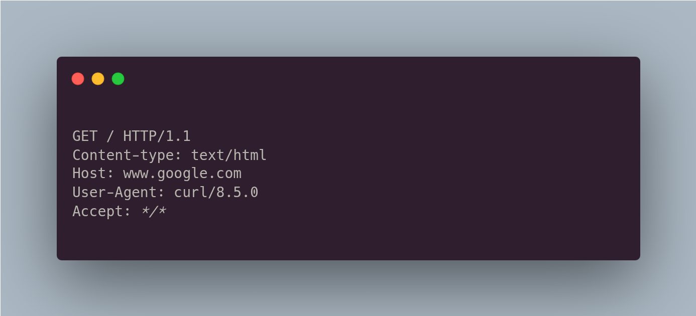
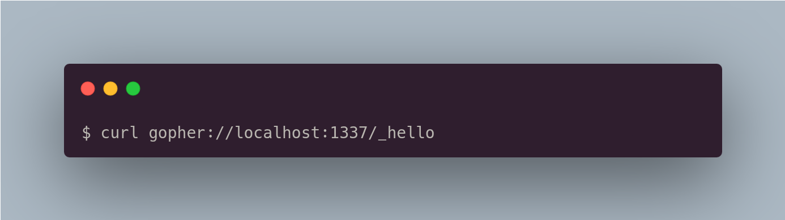
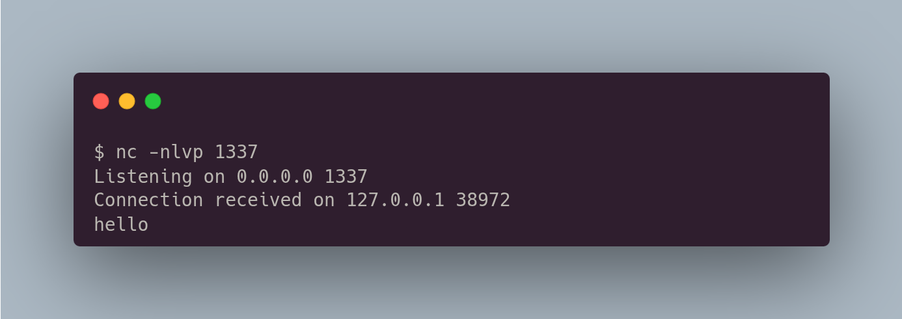

# SSRF (Server-side Request Forgery)

Server Side Request Forgery (SSRF) occurs when an attacker can create requests from the vulnerable server to the internet. Typically, the vulnerable server has a functionality that reads data from a URL, publishes data to a URL, or imports data from a URL. An attacker could abuse this functionality to read or update internal resources, or bypass access controls like firewalls that prevent the attackers from accessing them directly.

Antes de entrarmos nessa vulnerabilidade, precisamos conhecer uma técnica que é o `Protocol Smuggling`, que é basicamente uma técnica para acessar serviços internos através do SSRF. Geralmente, quando encontramos um SSRF em uma aplicação, ele realiza uma requisição utilizando o protocolo HTTP para a URL informada pelo usuário. O protocolo HTTP contém diversos headers, como o exemplo abaixo:

<div data-full-width="false"><figure><figcaption></figcaption></figure></div>

Como vamos acessar serviços internos que comunicam via socket através do SSRF? Para isso podemos utilizar o protocolo `gopher`, que se comunica com raw sockets. Se abrirmos um socket na porta 1337 e fazermos uma requisição utilizando o protocolo `gopher`, conseguiremos interagir com o socket. Veja no exemplo abaixo:

Primeiro vamos utilizar o netcat para ouvir na porta 1337 e receber a conexão.

```
$ nc -nlvp 1337
```

Agora, vamos utilizar o `gopher` para enviar uma informação `hello` para a conexão que está ouvindo na porta 1337. Lembrando que precisamos montar a URL da seguinte forma:

`gopher://` it's the protocol&#x20;

`localhost:` IPV4&#x20;

`1337` Port&#x20;

`/_` Prefix `hello` Data

<figure><figcaption></figcaption></figure>

Pronto, se notarmos, o netcat recebeu o dado `hello`, ou seja, enviados isso como dado para o socket.

<figure><figcaption></figcaption></figure>

Agora, vamos utilizar uma ferramenta chamada `Gopherus`, que serve para gerar payload para explorarmos serviços internos como mysql, redis, fastcgi (php-fpm), zabbix, memcached utilizando o protocolo gopher. Para obter essa ferramenta, podemos fazer um clone do repositório:


