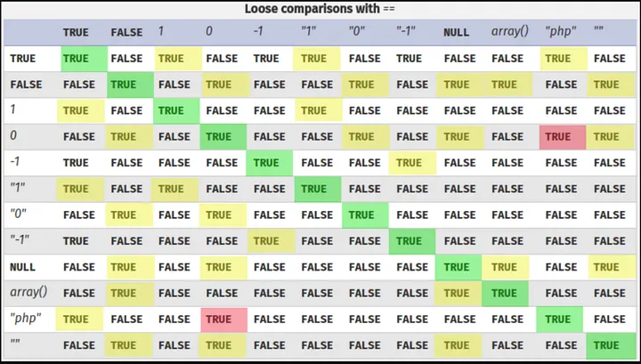
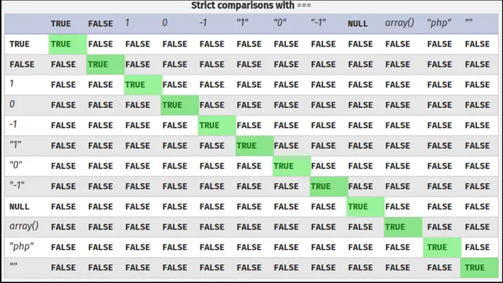

# Type Juggling

Type juggling vulnerability in PHP applications occurs when a loose comparison operator (`==` or `!=`) is used in the place of a strict comparison operator (`===` or`!==`) in a situation where the attacker has access to one of the variables being compared. For more details, we can see how comparison operators in PHP works in the following example:

PHP Comparisons: Loose

<figure><figcaption></figcaption></figure>

PHP Comparisons: Strict

<figure><figcaption></figcaption></figure>

## Scenarios of Exploitation

This vulnerability, though, is not always exploitable, frequently requires the use of a deserialization bug. This is due to the fact that POST, GET, and cookie values are typically supplied to programs as strings or arrays.

PHP would compare two strings if the program received the POST parameter from the previous example as a string, therefore no type conversion would be required. And it goes without saying that “0” and “password” are separate strings.

```php
var_dump("password" == "0");  // false
```

However, if the program accepts the input through functions like **json\_decode()** or **unserialize()**, type juggling issues can be exploited. The end-user would be able to specify the kind of input that is passed in in this way.
